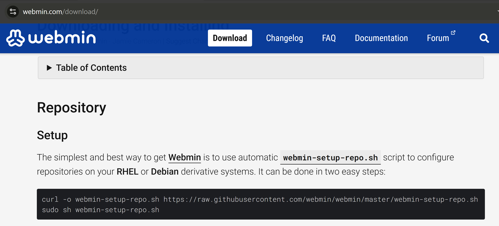
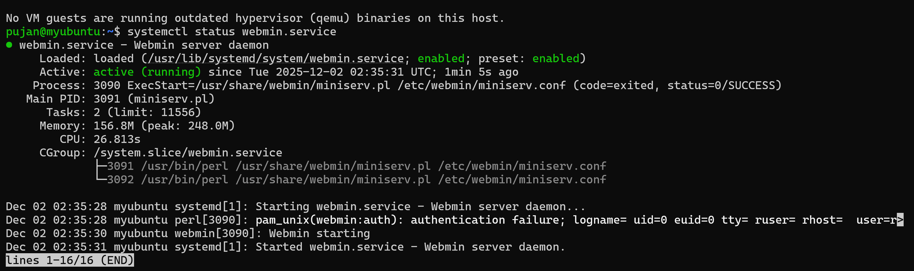

# Webmin Installation Guide for Ubuntu Server (CLI)

This document explains how to install **Webmin** on an Ubuntu Server using the command line and how to configure VirtualBox port forwarding to access the Webmin dashboard from your host machine.

---

## ## 1. Update Your System
Before installation, update your package list:

```bash
sudo apt update && sudo apt upgrade -y
```

---

## ## 2. Download the Webmin Repository Setup Script
Webmin provides an official script to configure its repository.

Install `curl` (if not installed):
```bash
sudo apt install curl -y
```

Download the Webmin setup script:
```bash
curl -o webmin-setup-repo.sh https://raw.githubusercontent.com/webmin/webmin/master/webmin-setup-repo.sh
```

---

## ## 3. Run the Repository Setup Script
Execute the script to add the Webmin repository and key:

```bash
sudo sh webmin-setup-repo.sh
```

---


## ## 4. Install Webmin
Once the repo is added, install Webmin with:

```bash
sudo apt-get install webmin --install-recommends -y
```

This will install Webmin along with recommended dependencies.

---
ubuntu installation screen:

---
## ## 5. Check Webmin Service Status
After installation, verify that Webmin is running:

```bash
systemctl status webmin.service
```

If running, the output should show **active (running)**.

systemctl status webmin.service

---

# # 6. Configure VirtualBox Port Forwarding (For Access from Host Machine)
If your Ubuntu Server is running inside VirtualBox, you must forward port **10000**.

### Steps:
1. Select your **VirtualBox VM** (Ubuntu Server) but **do not start it**.
2. Go to **Settings → Network**.
3. Ensure **Attached to: NAT**.
4. Click **Advanced → Port Forwarding**.
5. Add a new rule:

| Name        | Protocol | Host IP | Host Port | Guest IP | Guest Port |
|-------------|----------|----------|-----------|-----------|------------|
| Webmin      | TCP      | 127.0.0.1 | 10000    | 10.0.2.15 | 10000     |

> Note: Guest IP may vary. If unsure, run `ip a` inside Ubuntu to check.

Port Forwarding:

---

# # 7. Access the Webmin Dashboard
With the port forwarded, open your browser on your host machine and enter:

```
https://localhost:10000
```

You'll see the Webmin login page.

Login using your Ubuntu server credentials:
- **Username:** your system username
- **Password:** your system password

Webmin Dashboard:

---

# # 8. Optional Commands
Restart Webmin:
```bash
sudo systemctl restart webmin
```

Enable Webmin at boot:
```bash
sudo systemctl enable webmin
```

---

## Webmin is now successfully installed and accessible!
