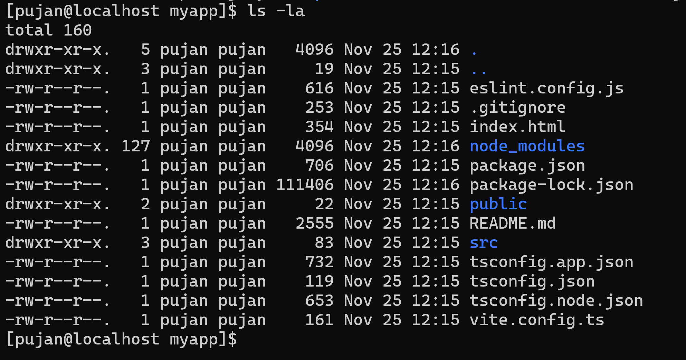
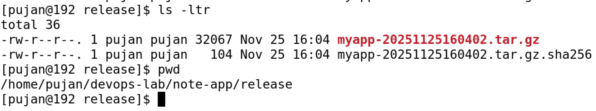

## Prerequisites

- Node.js project created (e.g., via `npm create vite@latest myapp`)  
- Bash shell on CentOS 9  
- `tar` and `sha256sum` commands available (default on CentOS)  

---
#### First we start by creating an app structure with 
`npm create vite@latest myapp`


#### Contents in `myapp` file after running `npm create vite@latest myapp`

## Directory Structure

Example directory structure before packaging:

```
note-app/
└── myapp/
    ├── node_modules/
    ├── public/
    ├── src/
    ├── package.json
    ├── package-lock.json
    ├── index.html
    ├── README.md
    ├── eslint.config.js
    ├── tsconfig.json
    ├── tsconfig.node.json
    ├── tsconfig.app.json
    └── vite.config.ts
```

---

## Script: `app_release.sh`

```bash
#!/bin/bash

# app_release.sh
# Purpose: Package release myapp into a release tarball with checksum

APP_DIR="myapp"
RELEASE_DIR="./release"
VERSION="$(date +%Y%m%d%H%M%S)"
TAR_FILE="${RELEASE_DIR}/${APP_DIR}-${VERSION}.tar.gz"
CHECKSUM_FILE="${TAR_FILE}.sha256"

# ----- 1. Create the Release Directory if not exists -----
mkdir -p "${RELEASE_DIR}"

# ----- 2. Validate required files exists -----
REQUIRED_FILES=( "eslint.config.js" "tsconfig.json" "tsconfig.node.json" "vite.config.ts" "package-lock.json" "tsconfig.app.json" "index.html" "package.json" "README.md" )
REQUIRED_FOLDERS=( "public" "src" )

# Checking required files
for file in "${REQUIRED_FILES[@]}"; do
    if [ ! -f "${APP_DIR}/${file}" ]; then
        echo "Error: Required file: '${file}' not found in ${APP_DIR}"
        exit 1
    fi
done

# Checking required folders
for folder in "${REQUIRED_FOLDERS[@]}"; do
    if [ ! -d "${APP_DIR}/${folder}" ]; then
        echo "Error: Required folder ${folder} not found in ${APP_DIR}"
        exit 1
    fi
done

# ----- 3. Create tarball excluding node_modules and .git -----
tar --exclude="${APP_DIR}/node_modules" --exclude="${APP_DIR}/.git" -czvf "${TAR_FILE}" "${APP_DIR}"

if [ $? -ne 0 ]; then
    echo "Error: Failed to create tarball"
    exit 1
fi

# ----- 4. Generate SHA256 checksum -----
sha256sum "${TAR_FILE}" > "${CHECKSUM_FILE}"

# ----- 5. Success Message -----
echo "Package created successfully: "
echo "Tarball: ${TAR_FILE}"
echo "Checksum: ${CHECKSUM_FILE}"
```

---

## How the Script Works (Step-by-Step)

1. **Create Release Directory**
   ```bash
   mkdir -p "${RELEASE_DIR}"
   ```
   Ensures a `release` folder exists to store the tarball and checksum.

2. **Validate Required Files**
   ```bash
   for file in "${REQUIRED_FILES[@]}"; do ...
   ```
   Checks that essential files (e.g., `package.json`, `index.html`) exist. Exits with an error if any are missing.

3. **Validate Required Folders**
   ```bash
   for folder in "${REQUIRED_FOLDERS[@]}"; do ...
   ```
   Ensures key directories like `src` and `public` exist before packaging.

4. **Create Tarball**
   ```bash
   tar --exclude="${APP_DIR}/node_modules" --exclude="${APP_DIR}/.git" -czvf "${TAR_FILE}" "${APP_DIR}"
   ```
   Packages the application while excluding unnecessary directories.

5. **Generate SHA256 Checksum**
   ```bash
   sha256sum "${TAR_FILE}" > "${CHECKSUM_FILE}"
   ```
   Creates a checksum file for verifying the integrity of the tarball.

6. **Print Success Message**
   ```bash
   echo "Package created successfully: ..."
   ```
   Displays the path to the tarball and checksum.

---

## How to Use

1. Make the script executable:
   ```bash
   chmod +x app_release.sh
   ```
2. Run the script from the `note-app` directory:
   ```bash
   ./app_release.sh
   ```

#### Output after running the file: 


#### Files inside the `release` folder:
