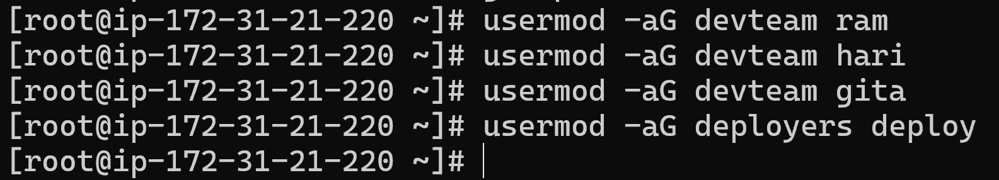
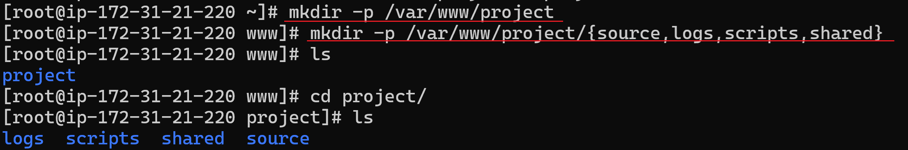
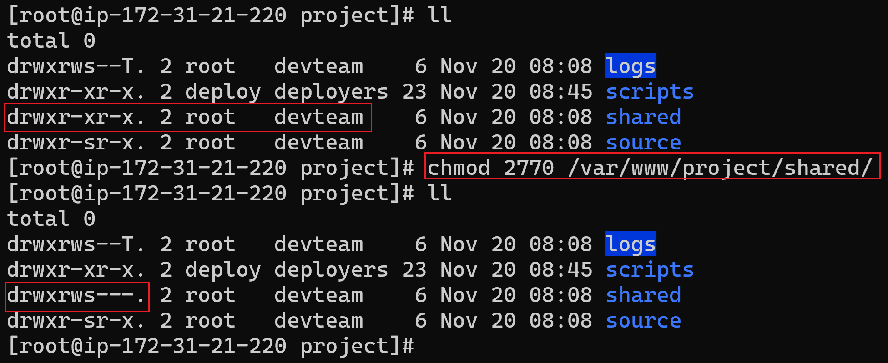
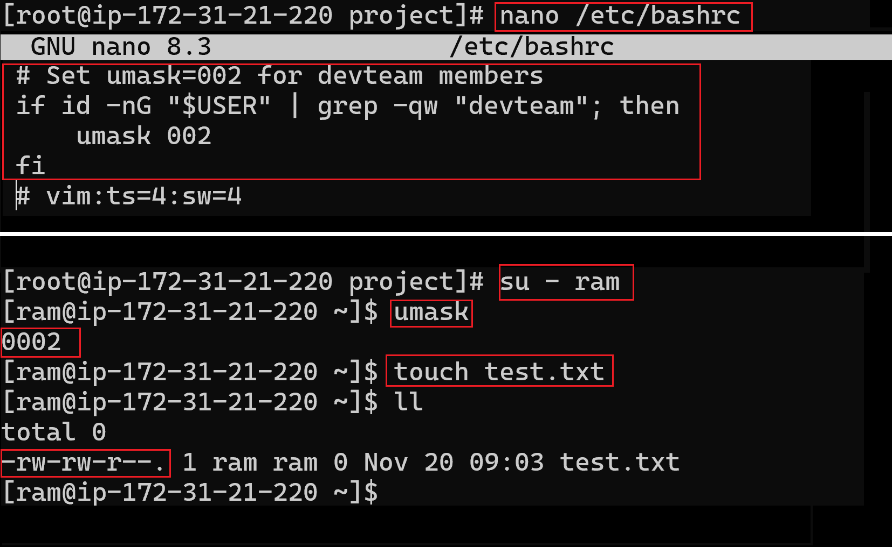

## Creating the instance and connecting it through SSH and changing to root user
First we start by 
- creating an instance in EC2
- saving the .pem key in our local repo
- using ```ssh``` to login to the instance via our pc

1. Create Users and Groups
```
useradd ram
useradd hari
useradd gita
useradd deploy

groupadd deployers
groupadd devteam
```


2. Adding Users to respective Groups 
```
usermod -aG devteam ram
usermod -aG devteam hari
usermod -aG devteam gita
usermod -aG deployers deploy
```


## Task 2: Directory & File Setup
1. Create `/var/www/project/` directory and sub-directories:
```
mkdir -p /var/www/project/{source,logs,scripts,shared}
```


2. Assign the ownership of the sub-directories to the respective groups through `chown`:
```
chown -R root:devteam /var/www/project/source
chown -R root:devteam /var/www/project/logs
chown -R root:deployers /var/www/project/scripts
chown -R root:devteam /var/www/project/shared
```


## Task 3: Apply correct permissions
1. Set permissions so that:
- Only members of `devteam` can enter and modify `/var/www/project/source/`
- The directory should have correct group ownership and `SGID` so new files inherit the group.
- Default umask for `devteam` members should be `002`
`(rwxrwxr-x for dirs, rw-rw-r-- for files)`
```
chmod g+s -R source/ 
```
**OR** 
```
chmod 2770 -R source/ 
``` 
***adds SGID*** 


2. For `/var/www/project/logs/`:
- Everyone in `devteam` can append to `logs`
- No one can delete or modify others’ log files → use **sticky bit**
```
chmod 3770 /var/www/project/logs 
```
**OR** 
```
chmod +t /var/www/project/logs
```
#### Why Sticky Bit? 
- Prevents users from deleting or renaming files they do not own


3. For `/var/www/project/scripts/deploy.sh`:
- Only the `deploy` user should be able to execute it.
- Use **SUID** so it runs with owner privileges (assume owner is root or deploy)
```
chown root:deployers /var/www/project/scripts/deploy.sh
chmod 4700 /var/www/project/scripts/deploy.sh
```
**OR**
```
chmod u+s /var/www/project/scripts/deploy.sh
```
- Allows controlled privileged execution
- Useful for deployment scripts requiring elevated access


4. For `/var/www/project/shared/`: 
- All `devteam` members can read and write
- Use **setgid** so all new files created belong to `devteam` group automatically.
```
chmod 2775 /var/www/project/shared
```
**OR**
```
chmod g+s /var/www/project/shared
```
#### Why SGID here? 
- Ensures all shared files belong to devteam
- Reduces permission conflicts during collaboration



## Task 4: umask and Default Permissions
1. Configure the system so that users in
`devteam` have a default **umask** of `002`
when they log in.
(Hint: Edit `/etc/bashrc` or user-specific profile)
```
nano /etc/bashrc
# Set umask=002 for devteam members
if if -nG "$USER" | grep -qw "devteam"; 
then umask 002 
fi
```
**OR**
```
echo 'umask 002' | sudo tee -a /etc/bashrc
```


## Task 5: Verification & Testing
1. As user `ram`, create a file in `shared/`
and verify:
- Group ownership is `devteam`
- Permissions are `664` (or `775` for directories)
2. As user `gita`, try to delete a file created by `ram` in `logs/` → should fail due to sticky bit.
```
su -ram
touch /var/www/project/shared/ramfile.txt
echo "hello" > /var/www/project/logs/ram.log

exit
su - gita
rm /var/www/project/logs/ram.log
rm: cannot remove '/var/www/project/logs/ram/log': Operation not permitted
```

3. As user deploy, execute the
`deploy.sh` script successfully even if not owner.
```
exit
su - deploy
vi /var/www/project/scripts/deploy.sh
echo "Hello Pujan!" 
CTRL + s 
CTRL + x
bash /var/www/project/scripts/deploy.sh
```
