# Data Persistence in Containers
### 1. Pull a NGINX or httpd container.
- First we start by pulling the nginx image from `hub.docker.com`
    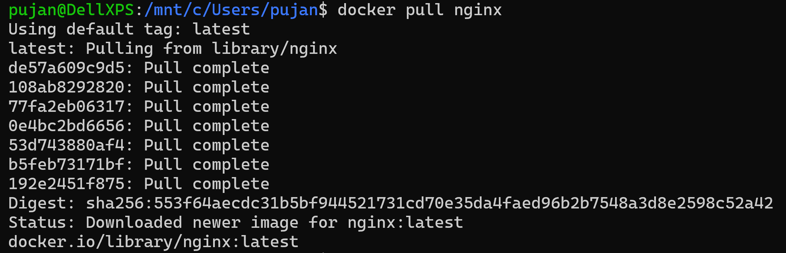
- We can see the image in Docker Desktop > Images
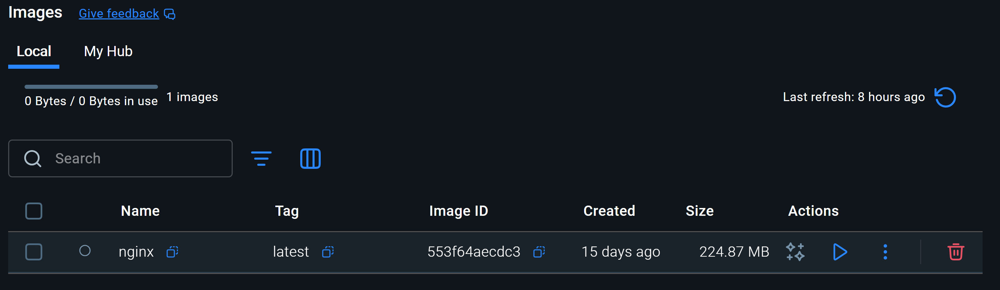

- Create the docker container from the image.
`docker run --name mynginx -p 80:80 -d nginx`
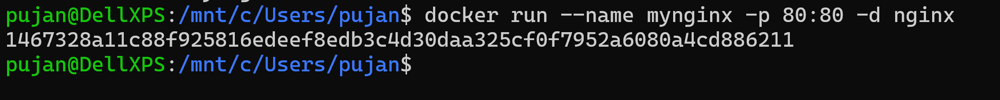

- The container has been created and can be viewed in Container section.
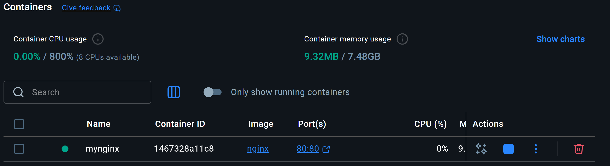
    ### 2. Browse the default page in http://localhost 
    When running the `http://localhost`, we can see:
    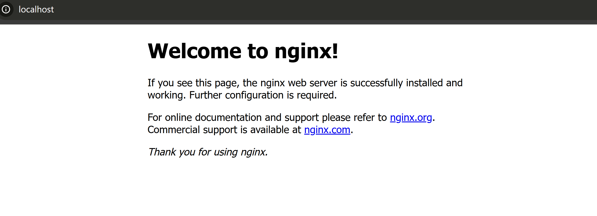

- We can check the container files in:

    `docker exec -it mynginx bash`

    `ls -l /usr/share/nginx/html/`

    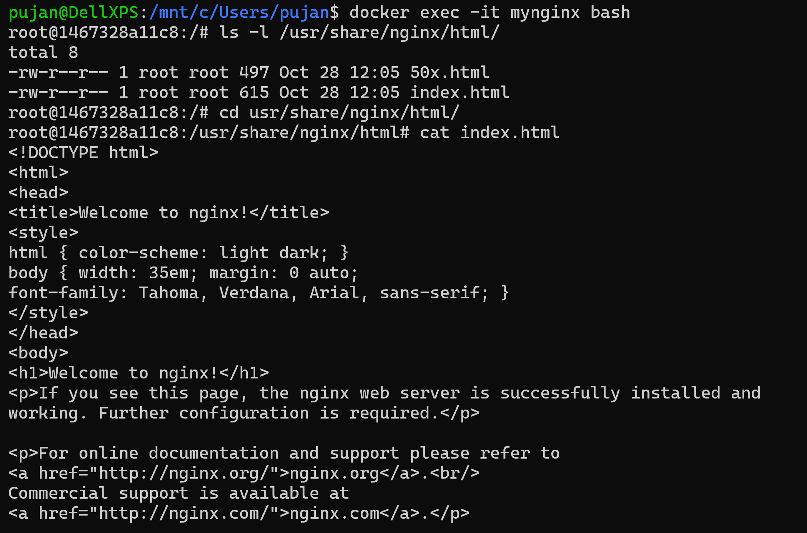

    ### 3. Alter the default content

    Now inside the container, we will make some changes to the default web contents.
- `docker exec -it mynginx bash`
- `echo '<h1>Hello World!! This is me PUJAN!!!</h1>' > /usr/share/nginx/html/index.html`
- `cat index.html`


- Now when we check the `localhost` again, we see `Hello World!! This is me PUJAN!!!`:
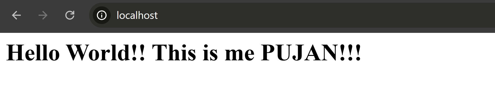

    ### 4. Stop and start the container again and check if the content persists.
- Next, we stop and start our container again.
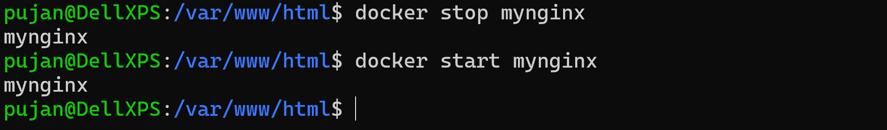
- Even after the container stopped and started, we can see that the content has persisted.


    ### 5. Remove the container and spin it again and check the persistence again.
- Stop the container `docker stop 1467328a11c8`
- Remove the container `docker rm 1467328a11c8`
- Spin another container `docker run --name mynginx -p 80:80 -d nginx`
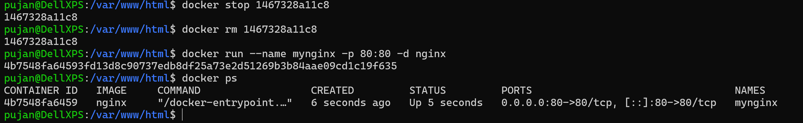
- Run the localhost webpage again `http://localhost`

    

- Here, we can see that the custom content is gone because we modified data inside the container, not in a persistent volume.

    ### 6. If content does not persist, try different ways to make it persistence.

- We will run nginx with a bind mount.

    ```
    docker run --name mynginx -p 80:80 -d \
    -v $(pwd)/nginx-data:/usr/share/nginx/html \
    nginx
    ```
    
- Here, we will see `Persistent Content` in `localhost` page.

    

    ###  7. Remove the container and spin it again and check the persistence again.

    We will restart the container

    `docker stop mynginx`

    `docker start mynginx`

- Again, while checking, our content persists

    

- Next, we will remove the container and re-run new container with the same bind mount

    ```
    docker rm -f mynginx

    docker run --name mynginx -p 80:80 -d \
    -v $(pwd)/nginx-data:/usr/share/nginx/html \
    nginx
    ```
- The content still persists because the file are stored in our host folder.

    


    ## (METHOD 2): We can achiece the same result with **Docker Volumes** as well
- First, we will create a volume named `nginx-volume`
- Secondly, we will run container using the volume
`docker volume create nginx-volume`
    ```
    docker run --name nginx -p 80:80 -d \
    -v nginx-volume:/usr/share/nginx/html \
    nginx
    ```
    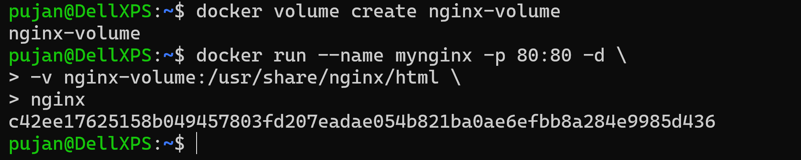

- We execute `mynginx` container in `interactive` mode with `bash shell` 
- We then enter the content in `/usr/share/nginx/html/index.html`
    ```
    docker exec -it mynginx bash
    echo "Content from Docker Volume" > 
    /usr/share/nginx/html/index.html
    exit
    ```
    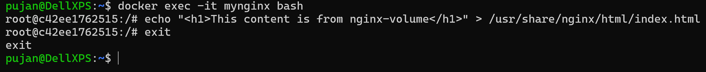

- We stop/remove the container and re-run a new container with same volue
    ```
    docker stop mynginx
    docker rm mynginx
    ```
    ```
    docker run --name mynginx -p 80:80 -d \
  -v nginx-volume:/usr/share/nginx/html \
  nginx
    ```
    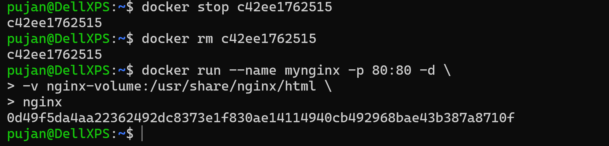

    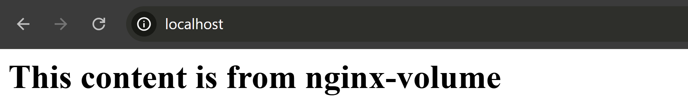
