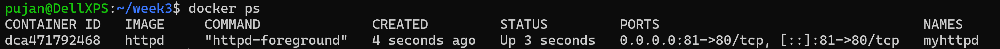
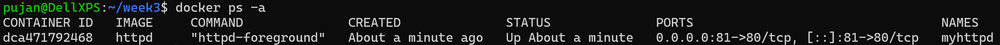
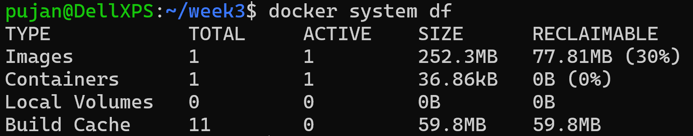
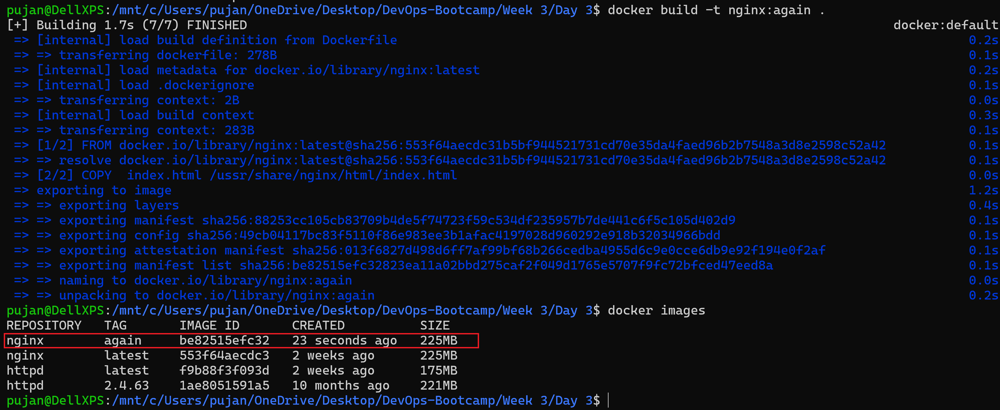

1.  To check for the running processes: `docker ps`


    To check all containers (running & stopped) `docker ps -a`

2. `docker system df`- shows the information regarding total/active images, containers, local volume, cache and the size they have accumulated.

3. `docker run --name not-nginx -p 81:80 -d httpd` 

    `http://localhost:81`-     prints "It Works!"

    To open the bash shell: `docker exec -it not-nginx bash`

    For `httpd`, the html files are inside this directory: `cd usr/local/apache2/htdocs`  
    Edit: `echo "<h1>Hello World! This is me Pujan!</h1>" > index.html`

    Now, if we refresh the browser, we can see the new content!

    To stop the container: `docker stop not-nginx`

    To remove the container: `docker rm not-nginx`

    ### To find the previous commands
    We can use `Ctrl + r` -> !902 (The number in the command) on your terminal and find run word.

    We can also use `history | grep <keyword of the command>`

    `Esc + .` gives the last  command

    ### Creating a volume and attaching it to the `httpd` index file
    ```
    1. Create a folder inside the Linux Machine : 
        > mkdir Week3 
        > vi index.html > </h1>This page confirms that the content is working!!!</h1>
    ```
    ```
    2. Then run  docker run --name not-nginx -p 81:80 -d \
        >-v "./index.html:/usr/local/apache2/htdocs/index.html" httpd
    ```
This will create a `volume bind mount` from the local directory to the httpd server


- **Note:** In docker compose file, we don't put detached mode.

### Creating a Docker compose file
```
    services:
        not-nginx:
            image: httpd
            container_name: not-nginx
            ports:
                - "81:80"
            volumes:
                - ./index.html:/usr/local/apache2/htdocs/index.html
```

`Note`: I have mapped the local directory to `/mnt/c/Users/pujan/OneDrive/Desktop/DevOps-Bootcamp/Week 3/Day 3` and am running it from the current directory.

- Save it to docker-compose.yaml

- Next we do `docker compose up -d`
- To shutdown `docker compose down`

## Next We create a `Dockerfile`
```
    # Use the official nginx base image
    FROM nginx:latest

    #Copy your custom index.html file into the container
    COPY  index.html /usr/share/nginx/html/index.html

    #(Optional) Expose port 80 if you haven't already
    EXPOSE 80
```

`docker build -t nginx:again .`

`-t`: tag

` .`: the image is present in the directory.



- Running our image: `docker run --name pujanginx -p 80:80 -d nginx:again`
- Now if we run `localhost:80` we can see `Welcome to Nginx!` page.