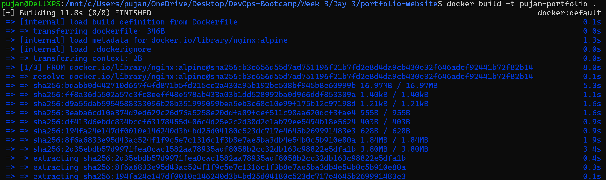
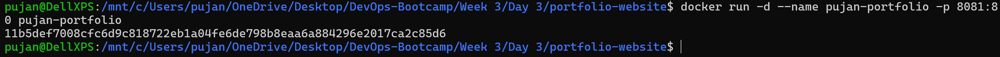
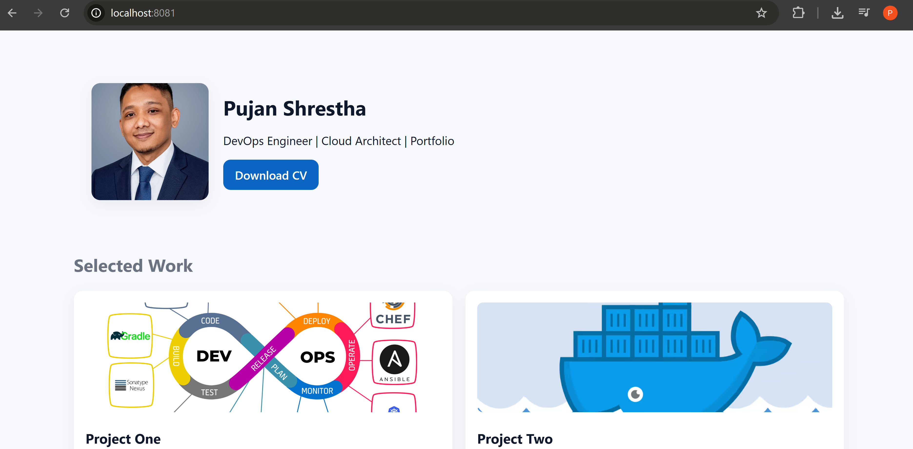
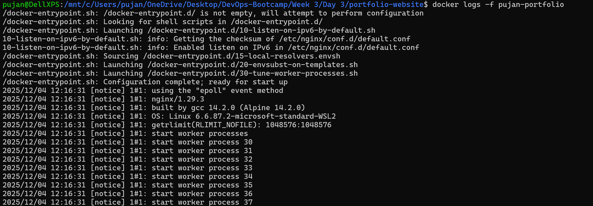

# Portfolio Website Docker Documentation

This document explains how I've build and run the Portfolio Website using Docker.

---

## Project Structure

```
portfolio-website/
├── Dockerfile
└── site/
    ├── index.html
    ├── styles.css
    ├── script.js
    ├── images/
    │   ├── profile-pic.jpg
    │   ├── Devops1.jpeg
    │   └── what-is-docker.png
    └── Pujan_CV.pdf
```

- `Dockerfile` — Docker configuration file
- `site/` — website files
- `images/` — profile and project images
- `Pujan_CV.pdf` — CV file downloadable from website

---

## Dockerfile Content

```dockerfile
# Use nginx lightweight image
FROM nginx:alpine

# Remove default nginx content
RUN rm -rf /usr/share/nginx/html/*

# Copy website files
COPY site /usr/share/nginx/html

# Expose port 80
EXPOSE 80

# Start nginx
CMD ["nginx", "-g", "daemon off;"]
```

---

## Step-by-Step Instructions (WSL)

1. Open WSL terminal.

2. Navigate to your project directory:

```bash
cd /mnt/c/Users/pujan/OneDrive/Desktop/DevOps-Bootcamp/Week\ 3/Day\ 3/portfolio-website
```

3. **Optional:** If OneDrive causes issues, copy to WSL home:

```bash
cp -r . ~/portfolio-website
cd ~/portfolio-website
```

4. Build the Docker image:

```bash
docker build -t pujan-portfolio .
```

5. Run the Docker container:

```bash
docker run -d --name pujan-portfolio -p 8081:80 pujan-portfolio
```


6. Open your browser and visit:

```
http://localhost:8081
```


7. To stop and remove the container:

```bash
docker stop pujan-portfolio
docker rm pujan-portfolio
```

8. To view logs:

```bash
docker logs -f pujan-portfolio
```

---


