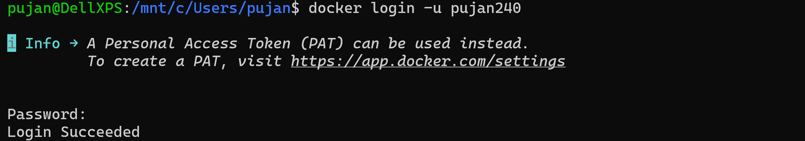
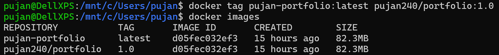
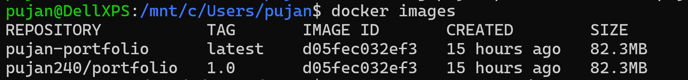
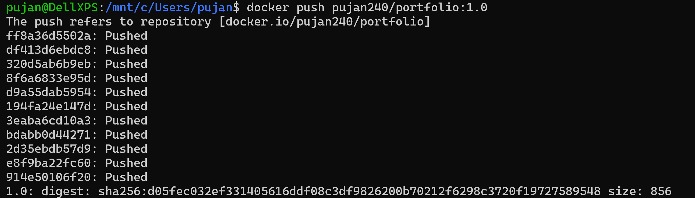
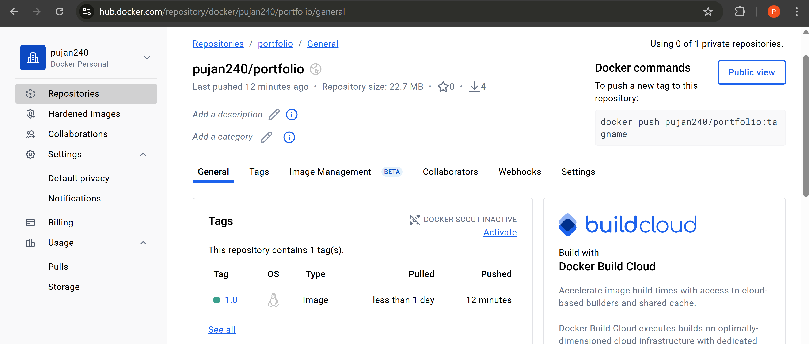
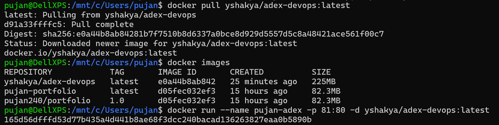

#### Today we pushed our image to `DockerHub`
1. First we login to our Docker Account from the CLI

---
2. Then we create a tag to push our local image to the remote repository

Here, 
- `pujan-portfolio:latest` is the local image.
- `pujan240` is our Docker Hub account
- `portfolio:1.0` is the repo name
---
3. If we check ``docker images`, we can see there is an additional image has been created.
 
---
4. Push the image to the `hub.docker.com` repository.
`docker push pujan240/portfolio:1.0`

---
5. The image is now available in our repository

---
6. To download the image and run in our local machine:
`docker pull yshakya/adex-devops:latest`
This downloads the image to our machine
---
To run the image to a container:
`docker run --name pujan-adex -p 81:80 -d yshakya/adex-devops:latest`

---
#### Note: 
##### Container compromises the statefulness of the data.
---