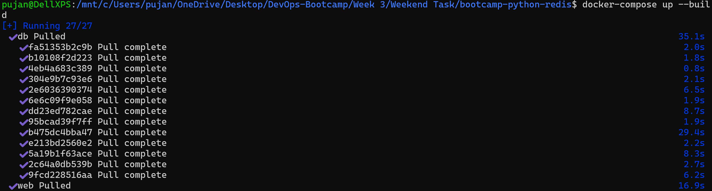
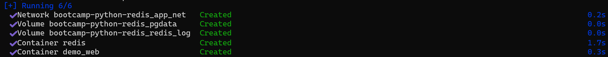
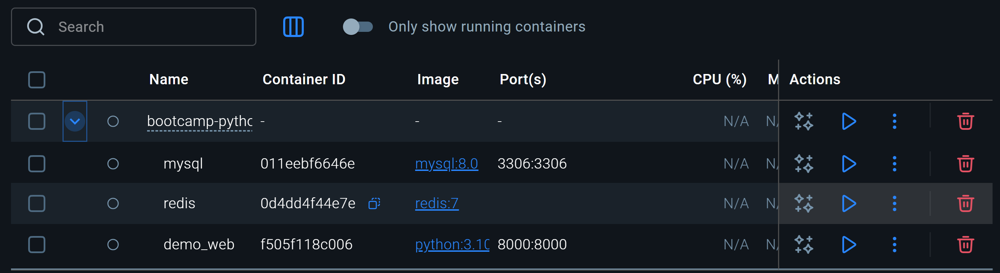
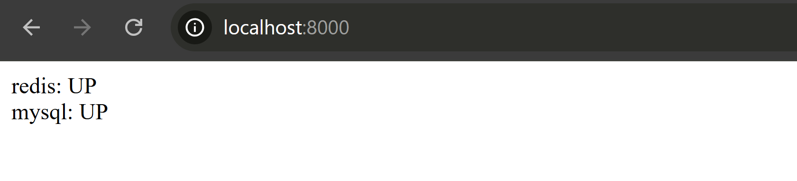
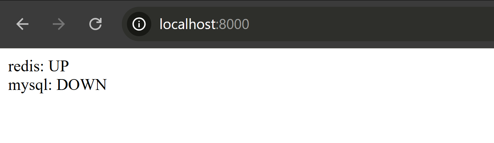
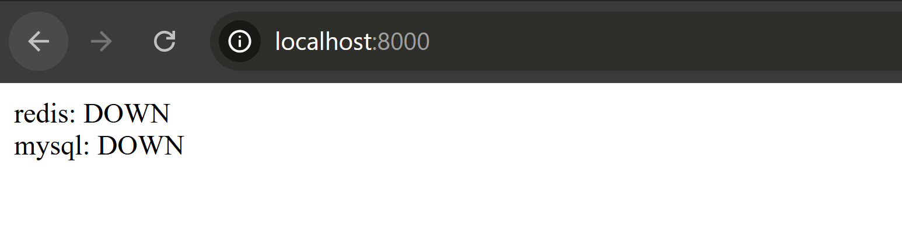

# Redis ping from Python
## Task Description

### Fork: https://github.com/adex-devops-bootcamp/python-redis

#### - Add database service/container on the existing docker-compose stack.

#### - The service in python should be rewritten to display     database along with redis.

#### - If redis, database or both is stopped, python app needs to update it as display.
---
#### The updated code with their respective functionalities are provided as follows:

#### `app.py`
```
from flask import Flask              # Import Flask to create a web application
import redis                         # Import Redis client library to connect to Redis
import mysql.connector               # Import MySQL connector to connect to MySQL database
from mysql.connector import Error    # Import Error class to handle MySQL connection exceptions

app = Flask(__name__)                # Create Flask app instance

# Redis client
r = redis.Redis(host="redis", port=6379)   # Create Redis client pointing to host "redis" and default port 6379

# MySQL config
mysql_config = {                     # Dictionary holding MySQL connection parameters
    "host": "mysql",                 # MySQL hostname (likely a Docker service name)
    "user": "demo",                  # MySQL username
    "password": "demopassword",      # MySQL password
    "database": "demo"               # MySQL database name
}

@app.route("/")                       # Define route "/" for the Flask app
def check_services():
    status = {}                        # Dictionary to hold the status of services

    #--- CHECK REDIS ---
    try:
        r.ping()                       # Send PING to Redis to check if it is reachable
        status["redis"] = "UP"         # If ping succeeds, mark Redis as UP
    except:
        status["redis"] = "DOWN"       # If ping fails (Redis down), mark Redis as DOWN

    #--- CHECK MYSQL ---
    try:
        conn = mysql.connector.connect(**mysql_config)  # Try connecting to MySQL using config
        if conn.is_connected():                        # Check if connection was successful
            status["mysql"] = "UP"                     # MySQL is reachable → mark as UP
        else:
            status["mysql"] = "DOWN"                   # Connection failed → mark as DOWN
    except Error:                                      # Catch MySQL connection errors
        status["mysql"] = "DOWN"                       # If exception occurs → mark as DOWN
    finally:
        if 'conn' in locals() and conn.is_connected(): # If connection exists and is open
            conn.close()                                # Close MySQL connection

    #---- FORMAT OUTPUT ----
    return "<br>".join([f"{service}: {state}" for service, state in status.items()])  # Return HTML-formatted string of service statuses

if __name__ == "__main__":
    app.run(host="0.0.0.0", port=8000)   # Run Flask app on all network interfaces at port 8000

```
---
#### `docker-compose.yaml`
```
services:

  web:
    image: python:3.10-slim       # Use lightweight Python 3.10 image as base
    container_name: demo_web      # Name the container "demo_web"
    working_dir: /app             # Set working directory inside container to /app
    volumes:
      - .:/app                    # Mount current host directory into /app (code sharing)
    command: >                    # Install Python dependencies and run Flask app
      sh -c "pip install -r requirements.txt && python app.py"    
    ports:
      - "8000:8000"               # Map container port 8000 to host port 8000
    networks:
      - app_net                   # Attach container to custom bridge network
    depends_on:
      - redis
      - mysql                     # Ensure Redis and MySQL start before this container

  redis:
    image: redis:7                # Use Redis version 7 image
    container_name: redis         # Container name "redis"
    volumes:
      - redis_log:/var/log/redis  # Persist Redis logs in a Docker volume
    networks:
      - app_net                   # Connect Redis to the same network as web & mysql
  
  mysql:
    image: mysql:8.0              # MySQL version 8 image
    container_name: mysql         # Container name "mysql"
    environment:                  # Environment variables to initialize DB
      MYSQL_ROOT_PASSWORD: rootpassword
      MYSQL_DATABASE: demo
      MYSQL_USER: demo
      MYSQL_PASSWORD: demopassword
    
    ports:
      - "3306:3306"               # Expose MySQL port to host
    
    volumes:
      - mysql_data:/var/lib/mysql     # Persist MySQL data in named volume
    networks:
      - app_net                       # Attach to same network as web & redis

volumes:
  redis_log:                    #stores Redis logs outside the container for persistence.
  mysql_data:                   #stores MySQL database files so data survives container restarts.

networks:
  app_net:                      #custom bridge network to allow internal container communication by hostname.
    driver: bridge              #All services (web, redis, mysql) are connected to this network.

```
---
#### requirements.txt
```
flask
redis
mysql-connector-python
```
---
#### `docker-compose up --build`

---

#### The containers are created, up and running

---

#### We can see the containers on `Docker Desktop` as well

---

####  When we run the `docker compose`, both `redis` and `mysql` service is up and running

---

#### When we stop `redis` but `mysql` is running

---

#### When we stop `mysql` but `redis` is running

---

#### When both `redis` and `mysql` are down

---