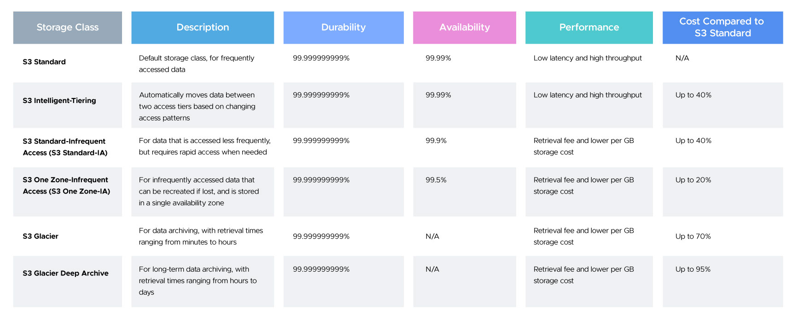
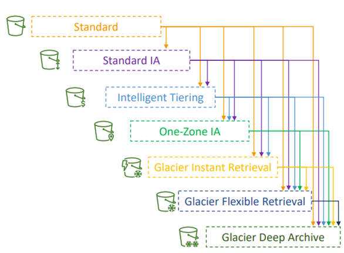

## S3 - Bucket Type and Storage Classes

### What is Amazon S3?
Amazon Simple Storage Service (S3) is a scalable object storage service for storing and retrieving any amount of data from anywhere on the web.
- Amazon S3 is one of the main building blocks of AWS
- It’s advertised as ”infinitely scaling” storage 
- Many websites use Amazon S3 as a backbone
- Many AWS services use Amazon S3 as an integration as well

**Key Features:**

 - **Durable:** 99.999999999% (11 9’s) durability.
- **Highly available.**
- **Secure:** Supports encryption ***(at-rest and in-transit)***.
- **Scalable:** Stores unlimited objects.
- **Flexible:** Different storage classes to optimize cost and performance.

---

### S3 Use Cases
1. Backup and storage
    - Store application data, files, images, and system backups reliably.
    - Highly durable storage (11 9’s) ensures long-term protection.
    - Works with AWS Backup and third-party backup tools.
2. Disaster Recovery
    - Supports multi-region replication (CRR/ SRR) for failover.
    - Enables quick restoration of data during outages or disasters.
    - Cost-effective DR strategy using Infrequent Access or Glacier classes.

3. Archive
    - Long-term data retention using Glacier and Deep Archive.
    - Lowest-cost storage for rarely accessed data.
    - Suitable for compliance, regulatory, and historical records.

4. Hybrid Cloud storage
    - Integrates with on-premises systems using AWS Storage Gateway.
    - Allows seamless movement of files between on-prem and cloud.
    - Ideal for gradual cloud migration or hybrid workloads.

5. Application hosting
    - Stores application assets, logs, binaries, and user data.
    - Used by native cloud apps due to scalability and low latency.
    - Can serve as backend storage for mobile and web applications.

6. Media hosting
    - Store and stream images, videos, audio, and documents.
    - Integrates with CloudFront for global content delivery.
    - Supports high-throughput workloads and large media files.

7. Data lakes & big data analytics
    - Central repository for structured and unstructured data.
    - Integrates with Athena, Glue, EMR, Redshift, and Lake Formation.
    - Enables large-scale analytics, ML pipelines, and ETL workflows.

8. Software delivery
    - Store and deliver software packages, updates, installers, and binaries.
    - Supports presigned URLs and versioning for controlled distribution.
    - Often used for CI/CD pipelines and artifact storage.

9. Static website
    - Host HTML, CSS, JS files directly from an S3 bucket.
    - Combined with CloudFront for performance and SSL.
    - Cost-effective and serverless alternative for simple websites.

---

## Types of Amazon S3 Buckets
### 1. Standard Bucket

A Standard Bucket is the default S3 bucket configuration used for general-purpose object storage.

- Designed for applications that require frequent read/write access.
- Ideal for storing documents, images, backups, media files, logs, and general application data.
- No advanced features (like versioning or encryption) are enabled by default, but they can be configured anytime.
- Provides high durability (11 nines) and availability across multiple Availability Zones.

---
### 2. Versioned Bucket

A Versioned Bucket keeps multiple versions of an object whenever it is modified or overwritten.

- Helps recover from accidental deletions, overwrites, or unauthorized changes.
- Every object stores its own version ID, allowing restoration to previous states.
- Supports MFA Delete for added protection on version removal.
- Useful for compliance, auditing, and maintaining historical data.

---
### 3. Encrypted Bucket

An Encrypted Bucket ensures that all objects stored are encrypted at rest, improving data security.
Supports multiple server-side encryption methods:

- SSE-S3 – Managed by Amazon S3 (AES-256 encryption).
- SSE-KMS – Encryption using AWS KMS keys with granular access control and audit logs.
- SSE-C – Customer-provided keys for complete control of encryption lifecycle.

This configuration is useful for sensitive or regulated data requiring encryption compliance (e.g., PCI-DSS, HIPAA, GDPR).

### 4. Logging Bucket

A Logging Bucket is specifically used to store server access logs generated by another S3 bucket.

- Helps track object-level operations such as GET, PUT, DELETE, and access patterns.
- Useful for security audits, usage monitoring, and compliance reporting.
- Best practice: store logs in a separate, dedicated bucket to avoid log loops or clutter.

---
### 5. Replication Bucket

A Replication Bucket acts as the source or destination for S3 Replication.
Supports two replication types:

- Cross-Region Replication (CRR) – Replicates objects between different AWS regions for global redundancy and disaster recovery.
- Same-Region Replication (SRR) – Replicates objects within the same region for compliance, low-latency reads, or backup.

Ideal for business continuity, multi-region architectures, and maintaining geo-distributed datasets.

---

### 6. Public Bucket (Intentionally Configured)

A Public Bucket is purposely configured to allow public access to its content.

- Used for static website hosting, public media distribution, open datasets, or documentation hosting.
- Managed using bucket policies, ACLs, and S3 Block Public Access settings.
- Not recommended unless the use case requires public exposure—should be managed carefully to avoid data leaks.

---
### 7. Intelligent-Tiering Enabled Bucket

This bucket is configured to automatically optimize storage costs using S3 Intelligent-Tiering.

- Moves objects between frequent, infrequent, archival, and deep archive tiers based on access patterns.
- Requires minimal management—ideal for datasets with unknown or unpredictable access frequency.
- Provides automatic cost savings without impacting performance.

---

### 8. Lifecycle-Managed Bucket

A Lifecycle-Managed Bucket has rules defined to control the transition, retention, and deletion of objects.
Lifecycle policies include:

- Moving objects from Standard → Standard-IA → Glacier or Deep Archive.
- Deleting old object versions.
- Cleaning up incomplete multipart uploads.
- Automatically transitioning logs or archival data.

Perfect for long-term data management, cost optimization, and ensuring compliance with retention policies.

---

## S3 Storage Classes
- Amazon S3 Standard - General Purpose
- Amazon S3 Standard-Infrequent Access (IA)
- Amazon S3 One Zone-Infrequent Access
- Amazon S3 Intelligent Tiering
- Amazon S3 Glacier Instant Retrieval
- Amazon S3 Glacier Flexible Retrieval
- Amazon S3 Glacier Deep Archive

***Can move between classes manually or using S3 Lifecycle configurations***

Amazon S3 offers multiple storage classes designed to optimize cost, performance, and access patterns. Each class is tailored for specific data usage needs—ranging from frequently accessed data to deep archival workloads. 

Each storage class is designed to balance availability, access speed, and cost based on how frequently data is accessed.

---

### 1. S3 Standard

S3 Standard is the default storage class if none of the storage class is specified during upload. It is ideal for frequently accessed data because it provides low latency and high availability. It has a wide range of use cases from cloud applications and web services, websites hosting, big data analytics, mobile gaming, and content distribution. It is the most expensive storage class among all others.

**Retrieval Time:** Milliseconds.

**Cost:** Highest among S3 classes but best for high-performance workloads.

#### Key Points: 

- High Availability and low latency
- Data is stored in multiple locations. So it is resilient against events that affect an entire Availability Zone
- The durability of 99.999999999% (11 9's) and availability of 99.99% availability over a given year. 
***Example: S3 standard has 99.99% availability = not available 53 minutes a year***
- Most expensive storage class among all others.

#### Use Cases:

- Dynamic websites and web applications
- Content distribution (images, videos, assets)
- Machine learning and big data workloads
- Mobile and gaming applications
- Databases or frequently changing datasets

---

### 2. S3 Standard-IA (Infrequent Access)

S3 Standard-Infrequent Access is optimized for long-lived and less frequently accessed data but requires rapid access whenever required. Similar to S3 Standard, it also offers high durability, low latency, and high throughput but has a low per GB storage price and per GB retrieval fee. The S3 Standard-IA is ideal for backups, long-term storage, and as a data store for disaster recovery.

**Retrieval Time:** Milliseconds.

**Cost:** Lower than S3 Standard, but higher retrieval cost.

#### Key Points: 

- High Availability and Low Latency (Same as S3 Standard)
- Offers greater availability and resiliency than the OneZone-IA storage.
- The durability of 99.999999999% and availability of 99.99% availability over a given year
- Less expensive than S3 Standard storage but you will be charged a retrieval fee hence suitable for infrequently accessed data.

#### Use Cases:

- Backups and snapshots
- Disaster Recovery (DR) data
- Log files or historical reports not accessed daily
- Long-term storage with occasional access

---

### 3. S3 One Zone-IA

S3 One Zone- Infrequent Access is for the data that is accessed less frequently but available for millisecond access. Since the other S3 storage class store data in a minimum of 3 Availability Zones (AZ), S3 One Zone-IA stores data in only one AZ which makes the costs 20% lesser than the S3 Standard-IA. It offers the same high durability, high throughput, and low latency. It can be considered a good choice for storing secondary backup copies or easily re-creatable data if an AZ fails.

**Retrieval Time:** Milliseconds.

**Cost:** 20% cheaper than Standard-IA.

#### Key Points: 

- Low Latency and High throughput performance
- The durability of 99.999999999% and availability of 99.5% availability over a given year
- Data will be lost if the Availability Zone where the data is stored is destroyed.
- Suitable for larger objects greater than 128 KB kept for at least 30 days (charged minimum for 30 days)

#### Use Cases:

- Secondary backups
- Re-creatable analytics data
- Temporary files or intermediate data
- Data with low business impact

---

### 4. S3 Intelligent-Tiering

S3 Intelligent Tiering optimizes costs by automatically moving data to the most cost-effective access tier, without performance impact or operational overhead. It moves objects that have not been accessed for 30 consecutive days to the infrequent access tier. If the object is accessed then it is automatically moved back to the frequent access tier. No retrieval fees or additional tiering fees are using the S3 Intelligent-Tiering storage class. It is ideal for storing long-lived data where the access patterns are unknown.

#### Key Points: 

- Low latency and high throughput performance
- Automatically moves the data between two access tiers. (Infrequent Access and Frequent Access)
- The durability of 99.999999999% and availability of 99.99% availability over a given year
- Small monthly monitoring and auto-tiering fee

#### Use Cases:

- Large datasets with unknown access patterns
- Data lakes and analytics workloads
- Long-lived application data
- Ideal when manually managing lifecycle rules is difficult

--- 

- Small monthly monitoring and auto-tiering fee
- Moves objects automatically between Access Tiers based on usage
- There are no retrieval charges in S3 Intelligent-Tiering
- **Frequent Access tier (automatic):** default tier
- **Infrequent Access tier (automatic):** objects not accessed for 30 days
- **Archive Instant Access tier (automatic):** objects not accessed for 90 days
- **Archive Access tier (optional):** configurable from 90 days to 700+ days
- **Deep Archive Access tier (optional):** config. from 180 days to 700+ days

---

## Amazon S3- Moving between Storage Classes

- You can transition objects between storage classes 
- For infrequently accessed object, move them to Standard IA
- For archive objects that you don’t need fast access to, move them to Glacier or Glacier Deep Archive
- Moving objects can be automated using a Lifecycle Rules.

---

## Amazon S3 – Lifecycle Rules

1. **Transition Actions** – configure objects to transition to another storage class
    - Move objects to Standard IA class 60 days after creation
    - Move to Glacier for archiving after 6 months
2. **Expiration actions** – configure objects to expire (delete) after some time
    - Access log files can be set to delete after a 365 days
    - Can be used to delete old versions of files (if versioning is enabled)
    - Can be used to delete incomplete Multi-Part uploads
3. Rules can be created for a certain prefix (example: s3://mybucket/mp3/*)
4. Rules can be created for certain objects Tags (example: Department: Finance)

## S3 Glacier Storage Classes
- **Low-cost object storage** meant for `archiving / backup`
- **Pricing:** price for storage + object retrieval cost

---

### 5. S3 Glacier Instant Retrieval

An archival storage tier offering millisecond retrieval, combining low-cost archival storage with fast access.

**Retrieval Time:** Milliseconds (unlike other Glacier tiers).

**Cost:** Lower storage costs, but `higher retrieval costs`.

---

- Millisecond retrieval, great for data accessed once a quarter
- Minimum storage duration of **90 days**.

---
- Lowest-cost option for data that still needs near real-time retrieval
- Suitable for long-term retention with occasional but immediate access needs

#### Use Cases:

- Medical images, X-rays, MRIs

- Financial or compliance data
- Media archives frequently referenced
- Digital preservation requiring instant access

---

### 6. S3 Glacier Flexible Retrieval (Formerly Glacier)

S3 Glacier is a low-cost storage class for data archiving where data access is infrequent. It provides a configurable retrieval time for the data from minutes to hours. This storage class uses a very low-cost Glacier storage service but the objects are still managed through S3.

---
#### Retrieval Time:

- **Standard retrieval:** 3-5 hours

- **Expedited retrieval:** 1-5 minutes (higher cost)

- **Bulk retrieval:** 5-12 hours (cheaper)

- **Cost:** Lower than Glacier Instant Retrieval.

- Minimum storage duration of 90 days

---

#### Key Points: 

- Low-cost design for long-term archiving
- Data will be available in case of entire Availability Zone destruction
- The durability of 99.999999999% and availability of 99.9% availability over a given year
- It has a minimum storage duration period of 90 days.
- Retrieval time ranges from minutes to hours
- Lower cost than Instant Retrieval
- Ideal for workloads that don’t require immediate access

#### Use Cases:

- Enterprise backups
- Research data archives
- Media archives that are rarely accessed
- Disaster recovery copies

---

### 7. S3 Glacier Deep Archive (for long-term storage)

The S3 Glacier Deep Archive provides the lowest-cost storage class and supports long-term retention and digital preservation for data that may be accessed only once or twice in a year. It is ideal for those industries which store data for 5-10 years or longer like healthcare, finance, etc. It can also be used for backup and disaster recovery.

---
#### Retrieval Time:
- **Standard retrieval:** 12 hours
- **Bulk retrieval:** 48 hours
- **Cost:** Lowest storage cost in S3, but highest retrieval time.
- Minimum storage duration of `180 days`

---

#### Key Points: 

- Lowest cost storage option in S3
- The durability of 99.999999999% and availability of 99.9% availability over a given year
- Retrieval costs can be reduced by using bulk retrieval
- It has a minimum storage duration period of 180 days
- Retrieval time: Several hours
- Ideal for regulatory or compliance data that must be preserved but rarely accessed
- Suitable for “coldest” storage scenarios

#### Use Cases:

- Government or legal compliance archives
- Medical record retention
- Historical research datasets
- Long-term digital preservation (10+ years)

---