# Cloudformation
### First We open CloudFormation from AWS Console

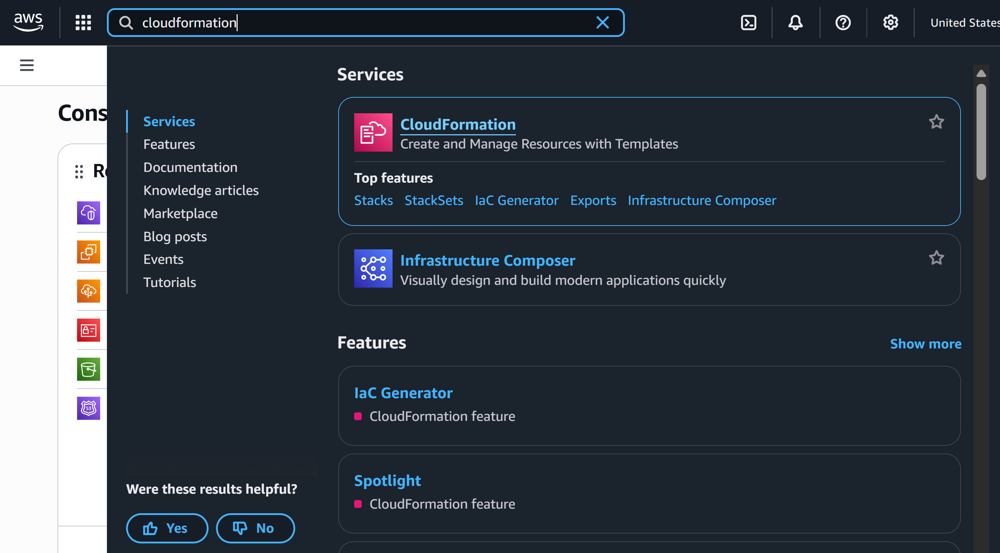
---
### Step 1 : `Create Stack` with new resources (standard)
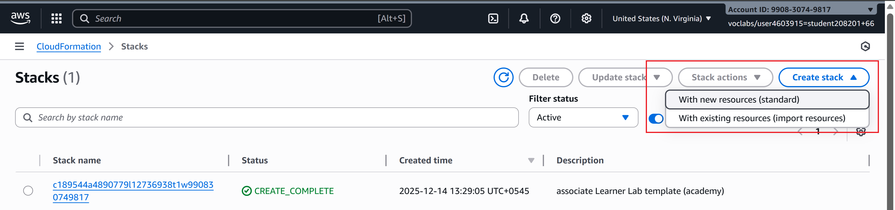
---

### Step 2: Choose an Existing Template > Upload a Template file > Select Next
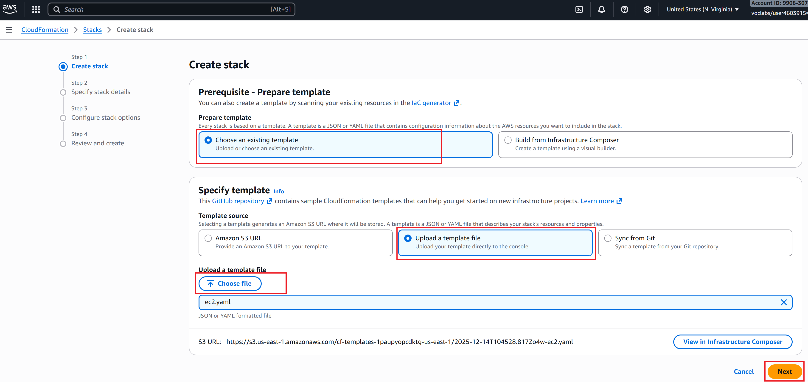

### I have specified the Stack Name as `Tekbay-EC2` and select the `Parameter` > `Keypair` as `cfm` (existing)

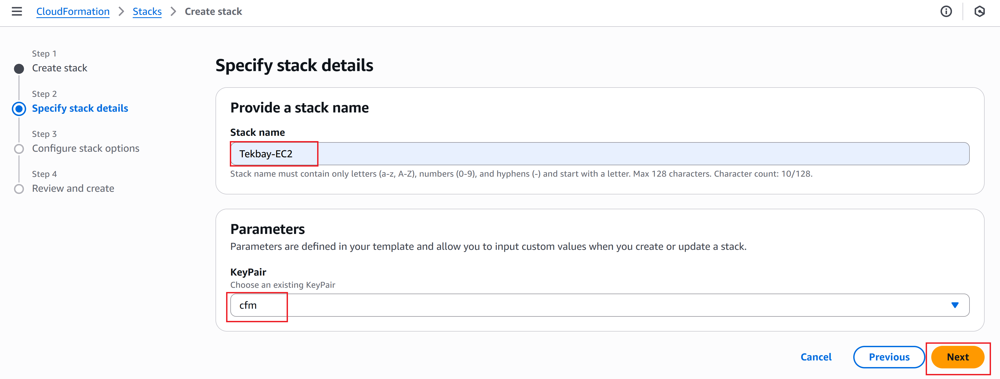

### Step 3: `Configure stack options` We will leave this as it is for this demo

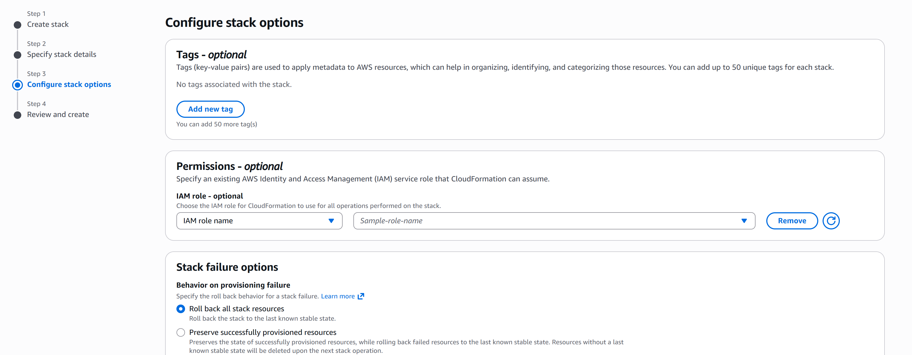

## Step 4: Next, we will `Review and create` the `stack` with `CloudFormation`

### This leads to the `Events` page in `Stack`. Where we can see the `events` created with our `yaml` file.
` It should be noted that it takes few minutes for all the resources to be up and running.`

### The following events have been created:
- Tekbay-EC2
- Elastic IP
- EC2 Instance
- Route Table
- SubnetRouteTableAssociation
- Subnet
- Internet Gateway
- VPCGatewayAttachment
- Security Group

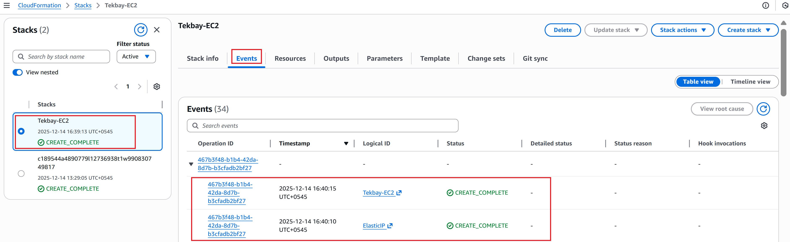
---

### Similarly, on the `Resource` section, we can see all the resources that have been created.
This provides other informations such as `Logical ID`, `Physical ID`, `Type`, `Status`

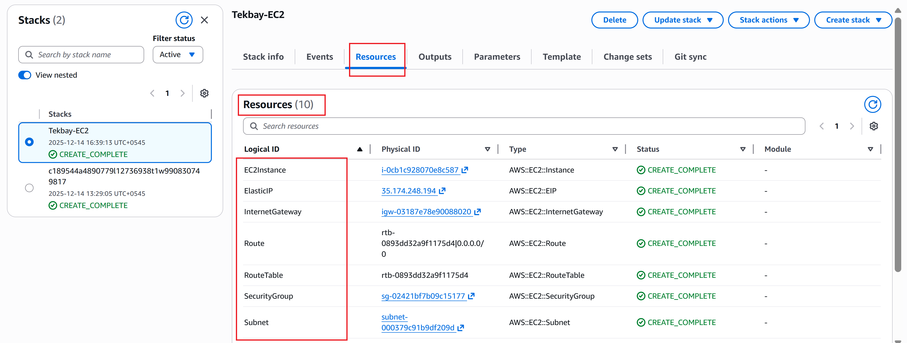

### The `Output` section provides the key output of the resources as specified in the `.yaml` file.

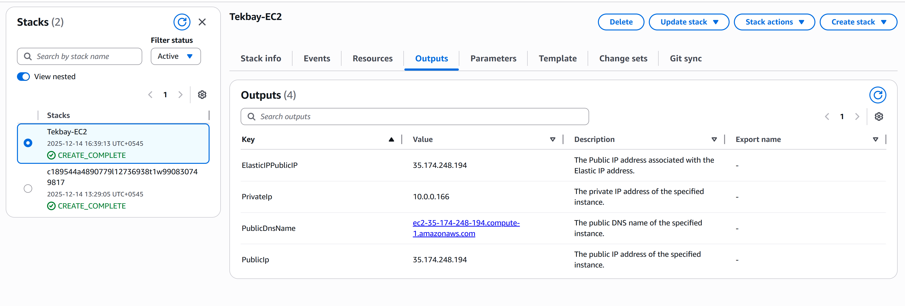

Moreover, we have other sections such as:

- `Parametes` which lets the user to adjust as per the requirement before initiating the `stack`.

- `Templates` which shows the template that we uploaded to initiate the stack.


Now that our stack has been created, up and running, we will now `SSH` into the `EC2 Instance`, update, upgrade the system and then install nginx and enable it.

`ssh -i cfm.pem ubuntu@100.31.34.160`

```
sudo apt update -y
sudo apt upgrade -y
sudo apt install -y nginx
sudo systemctl start nginx
sudo systemctl enable nginx
sudo systemctl status nginx
```

Now that the system is upto date and nginx being installed, we will transfer the `index.html` file from local to the `EC2 Server` via `scp`

`scp -i cfm.pem index.html ubuntu@100.31.34.160:/home/ubuntu`

Now that the file has been transferred to the `EC2 Server`, we will move it to the respective folder from where it will get displayed once the `Elastic IP` gets called.
`sudo mv index.html /var/www/html/index.html`

Now when trying to browse our `Elastic IP`, we can see the `index.html` page.


---


# Cloudformation with CLI

## Now we will do the same thing with AWS CLI

First we run `Ubuntu` in our local machine.
then we run:
We can check the `aws` version with 
`aws --version`. This ensures that `aws cli` is installed in our machine.

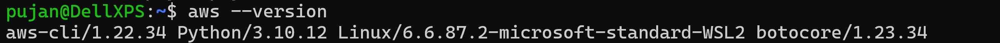

Next we run `aws configure` with our credientials. Since we are running `lab session`, the keys are present in `AWS Details` > `AWS CLI`

`aws configure`

This asks for 
- `AWS Access Key ID`
- `AWS Secret Key`
- `Default region name [us-east-1]`
- `Default output format [json]`

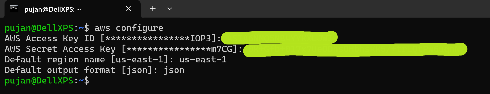

Once the credentials are validated, we have logged into our `AWS Account`.

### Step 1. Validate the template 
Now before running the `yaml` file, we first validate the `file`.

`aws cloudformation validate-template --template-body file://ec2.yaml`

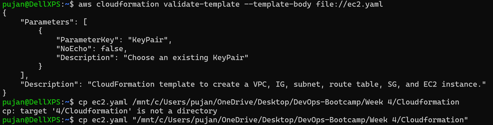

---

### Step 2. Create a Stack
A `stack` is an instance of our template running in AWS. Use:
```
aws cloudformation create-stack \
    --stack-name AdexStack \
    --template-body file://ec2.yaml \
    --parameters ParameterKey=KeyPair,ParameterValue=cfm
```
Here,
- Name of the Stack: `AdexStack`
- Template file with location: `file://ec2.yaml`
- Parameters: `KeyPair`
- Parameter Value: `cfm` (don't include `.pem`)

If you are unsure what `EC2 KeyPair` are listed, you can check with:
`aws ec2 describe-key-pairs --query 'KeyPairs[*].KeyName' --output table
` 

This gives the output in a table with the stored key names.
```
----------------
|   KeyName    |
----------------
| my-ec2-key   |
| dev-key      |
| admin-key    |
----------------
```
You can see the output as:

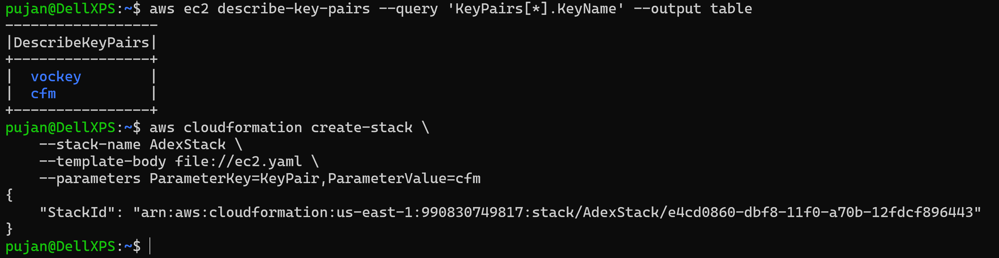

---

### Step 3: Check stack status
After creating, check progress:

`aws cloudformation describe-stacks --stack-name MyStackName`

- Look for `"StackStatus"` field.
- Statuses: `CREATE_IN_PROGRESS`, `CREATE_COMPLETE`, `ROLLBACK_IN_PROGRESS`, etc.

---

### Step 4: Update a stack (optional)

If you change the template or parameters:
```
aws cloudformation update-stack \
    --stack-name MyStackName \
    --template-body file://mytemplate.yaml \
    --parameters ParameterKey=KeyName,ParameterValue=my-new-key \
    --capabilities CAPABILITY_IAM
```
---

Now we will go to the `AWS Console` > `Cloudformation` to see the created ``stack`.

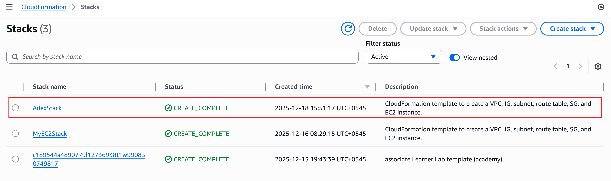

We can also view the `Stack Info`.

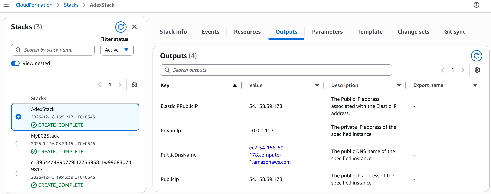

---

### Step 5: Delete a stack

When done, to avoid charges:
```
aws cloudformation delete-stack --stack-name MyStackName
```
To check the active stacks,
```
aws cloudformation list-stacks
```
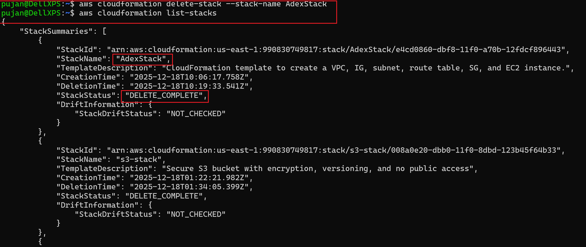

We can see in our `AWS Console` that our stack `AdexStack` has been completely deleted and removed from the list. ***It takes few minutes for the stack to be  completely deleted.***

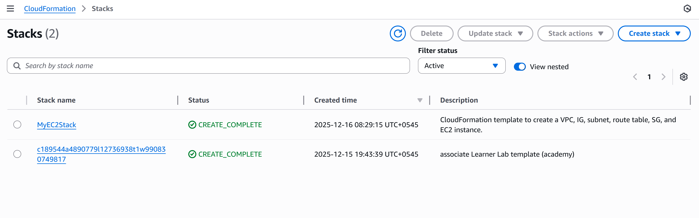

---
### Step 6: View events/logs

To debug errors during creation:
```
aws cloudformation describe-stack-events --stack-name MyStackName
```
It shows chronological events for troubleshooting.

---