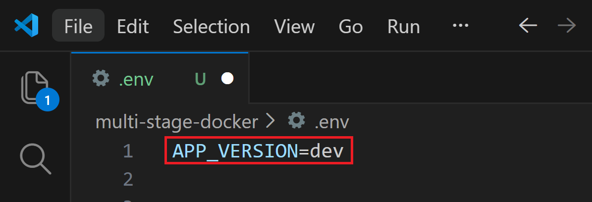
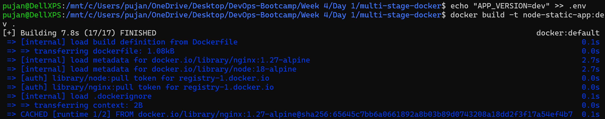
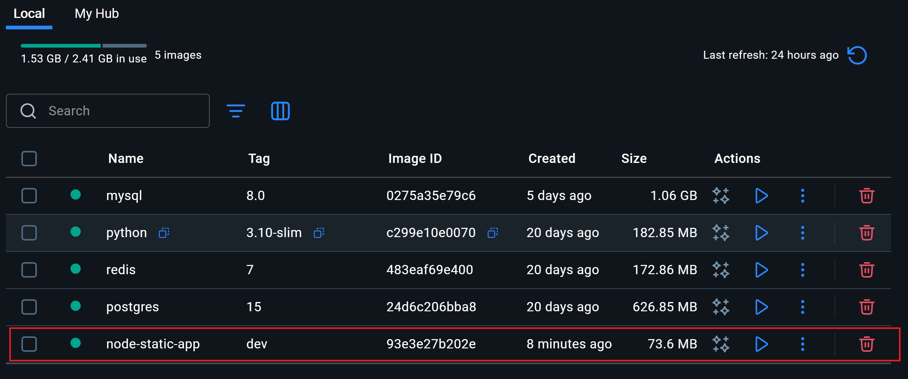
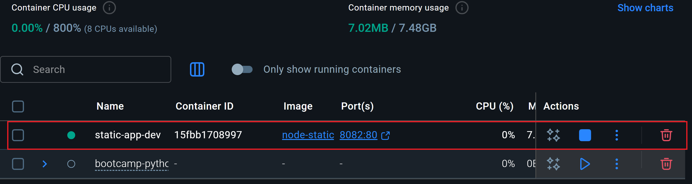
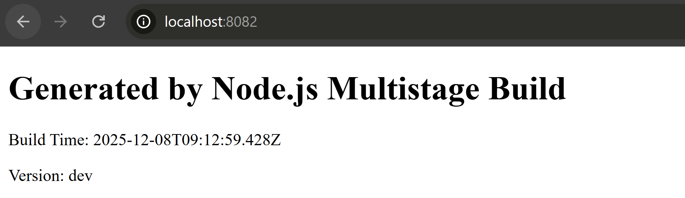
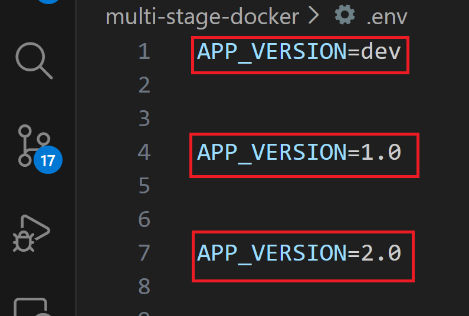
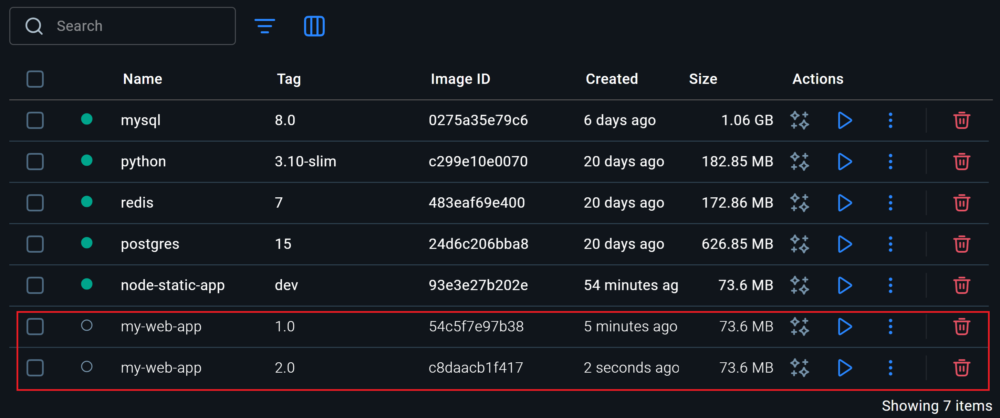
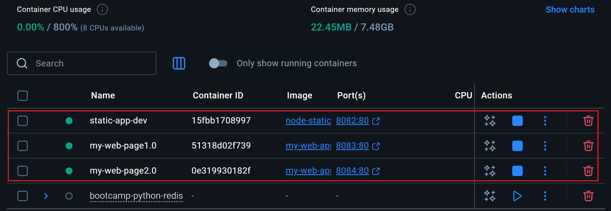
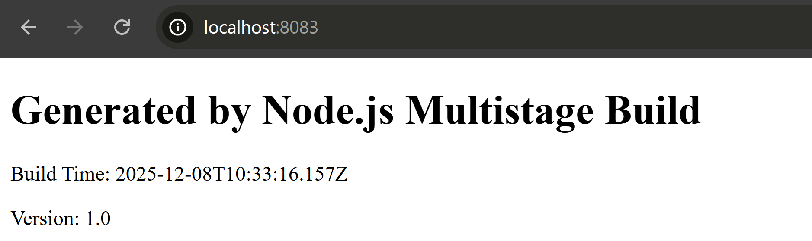
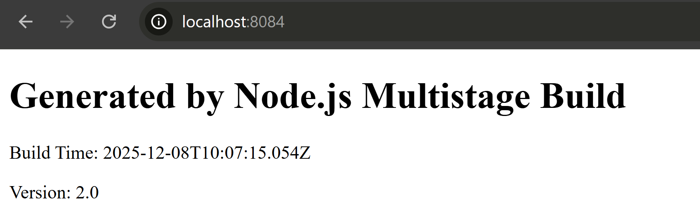

## Task Overview
## Containerize NodeJS App with Multi Stage Docker Build 
- Description Fork or copy GitHub - adex-devops-bootcamp/multi-stage-docker 
- Generate a lighweight Dockerfile Put screenshots in the comments or documentation of building the app with different version tags (Hint: .env)
---
This project uses a **multi-stage Docker build** to create a lightweight Docker image for a Node.js static site generator. The static site is generated using `build.js` and served using **Nginx**.

```
# Build Stage
#---------------
FROM node:18-alpine AS builder 
##using alias for the base image


# Specifying the working directory
WORKDIR /app


#Copying package files first to optimize caching
COPY package*.json ./

RUN npm install --only=production

#Copy Source code
COPY . .

#Ensures dist folder exists and creates if not already created
RUN mkdir -p dist

#Build html file
RUN npm run build


# Runtime Stage 
# We are using nginx to serve static HTML
#----------------------------------------
FROM nginx:1.27-alpine AS runtime

#Copy build output from builder stage
COPY --from=builder /app/dist /usr/share/nginx/html

#This publishes port 80 inside the container to port 8080 on our machine.
#nginx listens on port 80 by default
EXPOSE 80

CMD [ "nginx", "-g", "daemon off;" ]


```
### Breaking the code down:
## Build Stage Explanation

- **Node.js base image (`node:18-alpine`)**  
  A lightweight Node.js image is used for building the project. Using `AS builder` names this stage so we can copy artifacts to the runtime stage later.

- **Working directory**  
  The working directory inside the container is set to `/app`, which keeps all project files organized in a single location.

- **Copying `package.json` and `package-lock.json` first**  
  This leverages Docker caching. If dependencies have not changed, Docker can skip reinstalling them in subsequent builds, speeding up the build process.

- **`npm install --only=production`**  
  Installs only the production dependencies, excluding devDependencies. This reduces the size of the image and ensures only necessary packages are included.

- **Copying project files**  
  All source files, templates, and scripts are copied into the container for building the project.

- **`mkdir -p dist`**  
  Ensures that the output directory for the generated HTML (`dist`) exists. The `-p` flag prevents errors if the folder already exists.

- **`npm run build`**  
  Runs `build.js` to generate the `index.html` in the `dist` folder, using values from the `.env` file such as the app version.

---

## Runtime Stage Explanation

- **Nginx base image (`nginx:alpine`)**  
  A small Nginx image is used to serve the generated static HTML. Node.js is not required at this stage, which keeps the final image lightweight.

- **Copying generated files from the builder**  
  The `dist` folder from the build stage is copied to Nginx’s web root (`/usr/share/nginx/html`) so it can be served to clients.

- **Exposing port 80**  
  Port 80 is exposed for HTTP access, allowing users to view the site in a browser.

- **`CMD ["nginx", "-g", "daemon off;"]`**  
  Starts Nginx in the foreground.  
  - **Why not use `["node", "build.js"]`?**  
    The build stage already generated the static site. At runtime, we only need to serve the static files efficiently. Nginx is faster and more resource-friendly for serving static content than Node.js.

## Summary

- **Multi-stage builds** reduce the final image size by separating build and runtime environments.
- **Production-only dependencies** keep the image lean.
- **Ensuring output directory exists** prevents build errors.
- **Nginx runtime** efficiently serves static content without Node.js, optimizing performance and size.

---
#### First we run: `echo "APP_VERSION=dev" >> .env`
#### This appends the image log in `.env` file.

---
#### We create `docker image` with:
#### `docker build -t node-static-app:dev .`

---
#### We can see the image in `Docker Desktop` as well

---
#### Next we run the container in `port 8082` with its name as `static-app-dev`

`docker run -d -p 8082:80 --name static-app-dev node-static-app:dev`

#### This creates our container from the image. We can see the container in `Containers` section in `Docker Desktop`

---
#### When running `localhost:8082` on our browser, shows the contents of the `HTML` file with `Build Time` and the `Version`: in this case; `dev`.

---
#### Similarly, to see the changes in the Version of our HTML web page, we build two more images and containers, `my-web-app:1.0` and `my-web-app:2.0` from the `Dockerfile`.
The command to build the images from the `Dockerfile` are:

`echo "APP_VERSIO=1.0" >> .env`

`docker build -t my-web-app:1.0 .`

`echo "APP_VERSIO=2.0" >> .env`

`docker build -t my-web-app:2.0 .`




---
We build two more `containers` from their respective `images`.
The command to create those `containers` are as follows:

`docker run -d -p 8083:80 --name my-web-app1.0 my-web-app:1.0`

`docker run -d -p 8084:80 --name my-web-app2.0 my-web-app:2.0`


---
#### When running the respective ports on localhost, we can see the changes in the `Version`:




