# PaaS - Deploy an app that displays version in webpage in AWS ElasticBean

## Step 1 — Create a Simple App

Our application has the following folder structure:
```
my-eb-app/
│── app.py
│── application.py
│── requirements.txt
│── .ebextensions/
      └── 01_python.config
```
---
`app.py`
```
from flask import Flask   #Imports Flask
import os

app = Flask(__name__)     #Initializes the Flask application

@app.route("/")           #Defines the homepage (/)
def home():
    version = os.getenv("APP_VERSION", "v1.0.0")   #Fetches the version from an environment variable
    return f"<h1>Hello from Elastic Beanstalk!</h1><p>Version: {version}</p>"    #Returns dynamic HTML content

if __name__ == "__main__":
    app.run(host="0.0.0.0", port=5000)        #This part runs only locally
                                              #EB never uses this section (EB uses Gunicorn instead)

```
The above code for `app.py` does the following:

- Creates the Flask web server

- Defines a route ("/")

- Reads an environment variable APP_VERSION
(default version is v1.0.0)

- Displays the version on the webpage

`requirements.txt`
```
flask
gunicorn
```

The above `requirements.txt` tells Elastic Beanstalk which `Python packages` to install.

- `flask` is required to run your Python web application.
- `gunicorn` is a production-grade WSGI server used by Elastic Beanstalk

`application.py`

```
from app import app as application
```
The above code:
- Imports the Flask app from app.py

- Renames it to application so EB can detect it

- Enables Gunicorn/Nginx to start our application correctly

Without this file, Elastic Beanstalk will not know how to start our Flask app.

---

`.ebextensions/01_python.config`

```
option_settings:
  aws:elasticbeanstalk:container:python:
    WSGIPath: application:application

  aws:elasticbeanstalk:healthreporting:system:
    SystemType: enhanced
```
The above code does the following:
```
    WSGIPath: application:application
```
Tells Elastic Beanstalk where the WSGI entry point is.
- application.py (filename)
- application (WSGI callable inside the file)

This ensures our app starts as `gunicorn application:application`

```
aws:elasticbeanstalk:healthreporting:system:
  SystemType: enhanced
```
This enables enhanced health monitoring of our application.

Enhanced health gives:
- better logs
- cause-based health indicators
- automatic failure detection

This is recommended for all modern EB environments.

---
We now `zip` the file. 

`Make sure the zip folder  has a folder structure as such:`
```
my-eb-app.zip/
│── app.py
│── application.py
│── requirements.txt
│── .ebextensions/
      └── 01_python.config
```
---

## Step 2 — Create Elastic Beanstalk App

#### First we log in to AWS Console

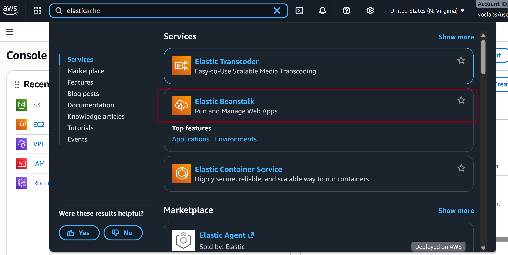
---

Then we `Create Application`

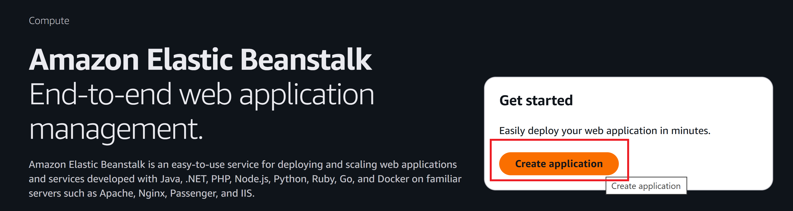

#### Create Elastic Beanstalk App (with AWS Console)
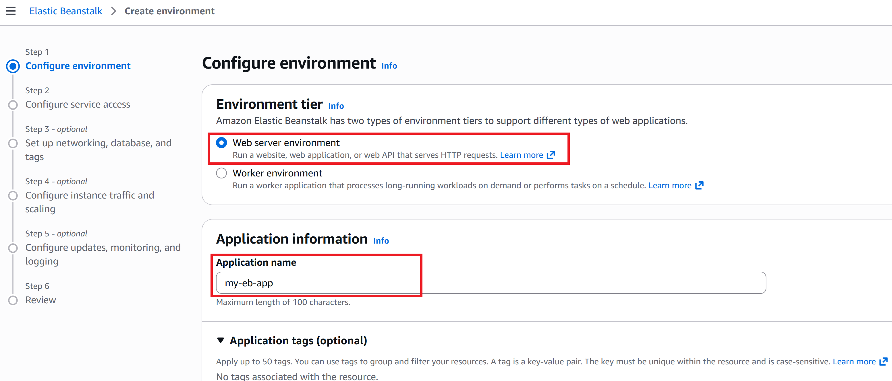
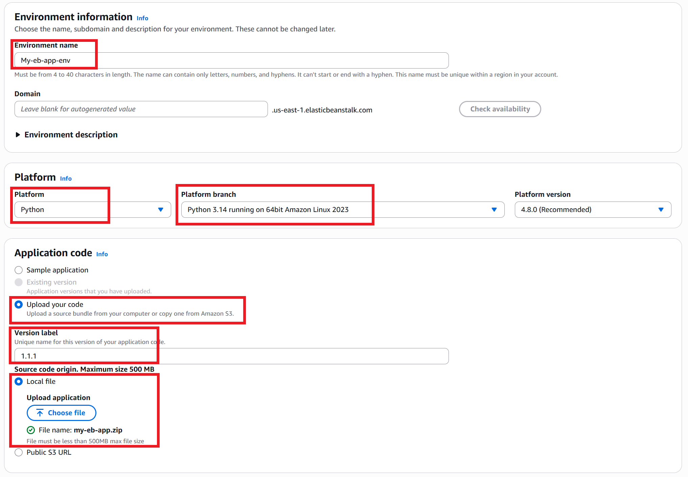


Step 2
Configure service access
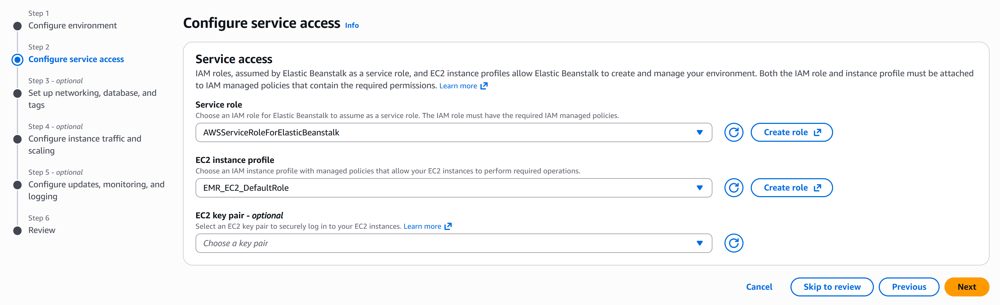

Our ElasticBeanstalk application has been successfully created.
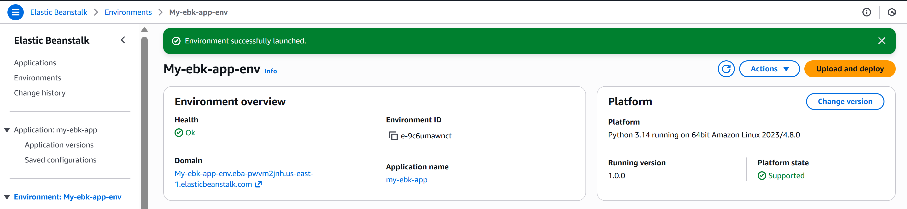


#### Launch website


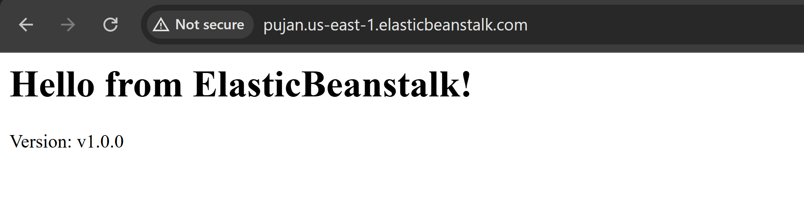

The version showed as `v1.0.0` as it was configured in our `app.py` which can be seen in the snippet below:
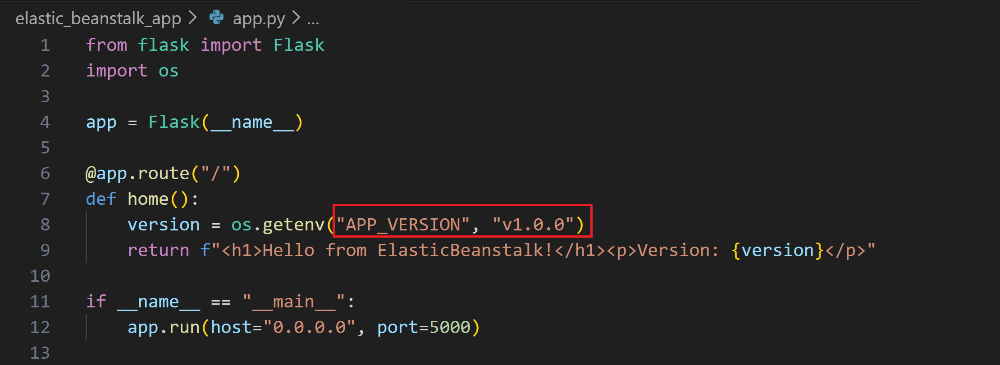

---
## Re-upload with the change in version to `v2.0.0`:

For this we need to make a change to the app file in our local machine.

- I will be changing the `APP_VERSION` in my file and `zip` the folder again with the name `my-eb-app2.zip`.

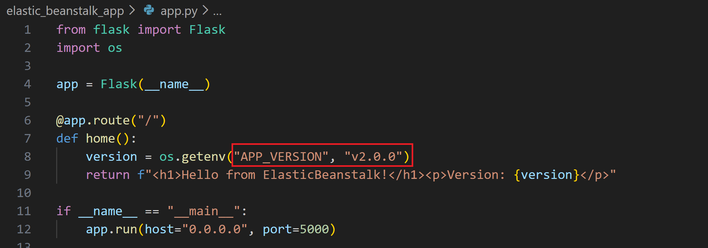

To re-upload another version, in our `AWS Console`,we have an option to `Upload and Deploy` .
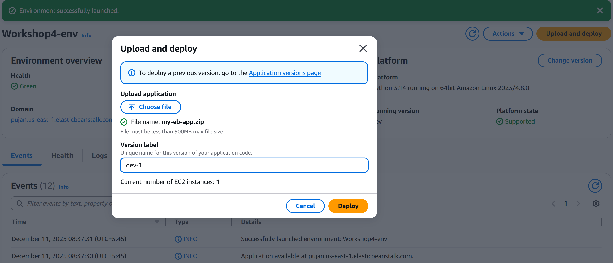

#### The website shows the new `APP VERSION`

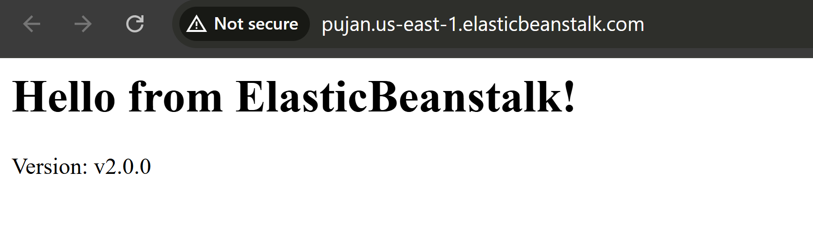

---
### Rollback to a previous version
#### To Rollback to the previous version:

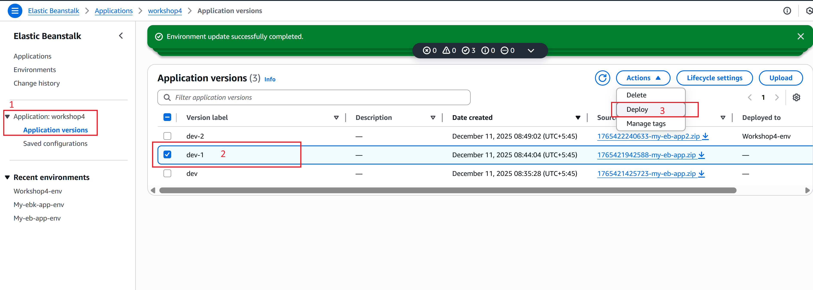


#### We have successfully rolled-back to the `previous version` of our website.


---