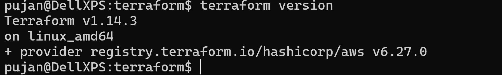
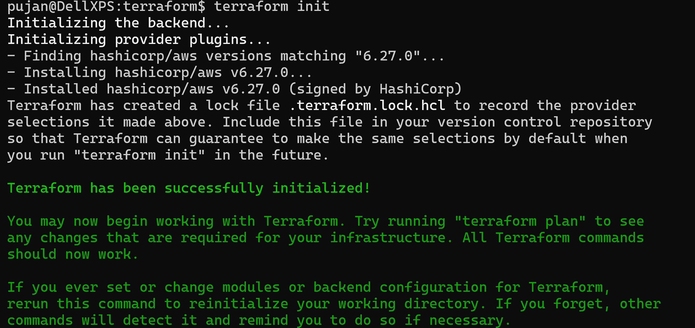
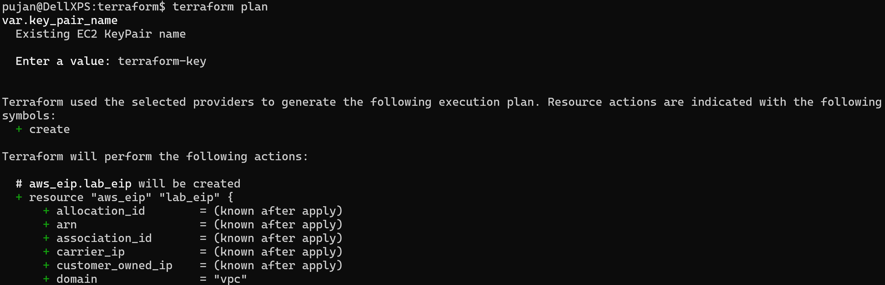
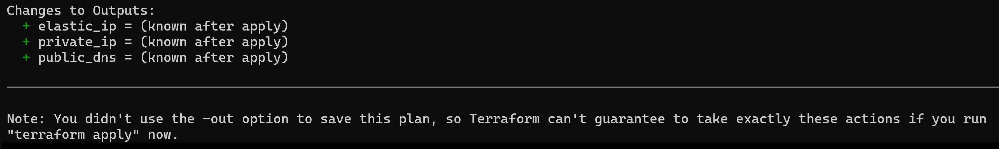
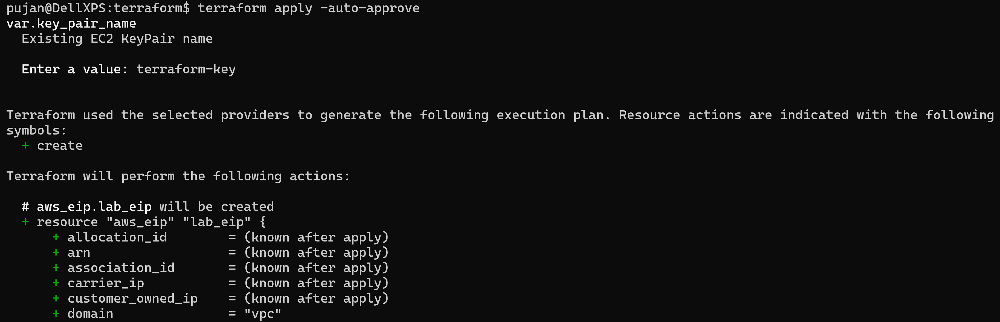
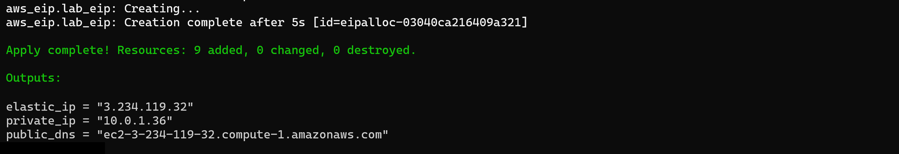
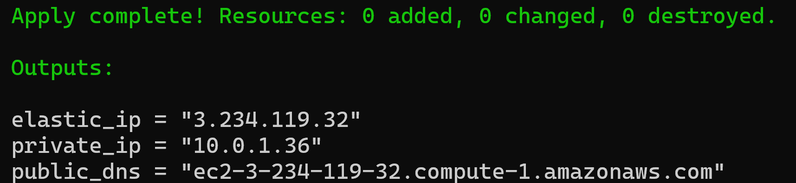
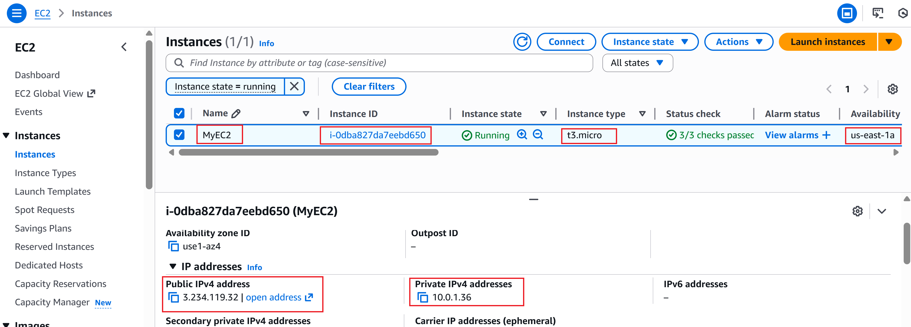
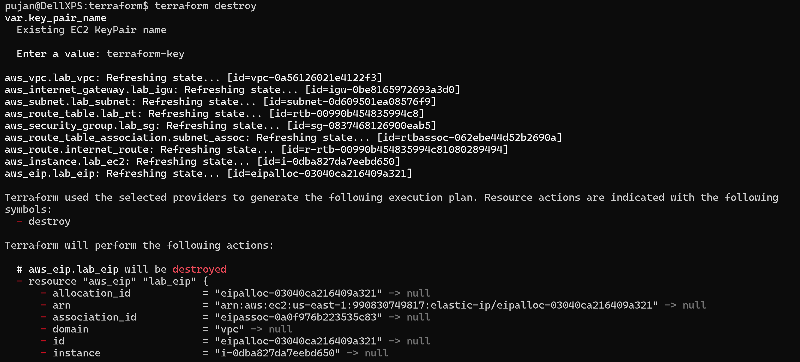
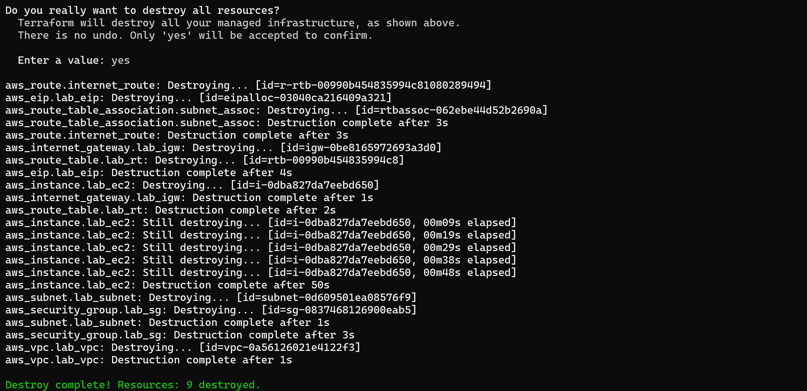

# AWS EC2 Infrastructure Provisioning Using Terraform

## Overview

This project demonstrates how to provision a complete AWS infrastructure using **Terraform**.  
The infrastructure includes:

- VPC
- Internet Gateway
- Public Subnet
- Route Table and Internet Route
- Security Group (SSH + HTTP)
- EC2 Instance (Ubuntu 24.04)
- Elastic IP
- Terraform Outputs

This project was created as a hands-on learning exercise to understand how AWS CloudFormation concepts translate into Terraform.

---

## Architecture Diagram (Logical)

VPC (10.0.0.0/16)  
└── Public Subnet (10.0.0.0/24)  
  ├── Route Table → Internet Gateway  
  ├── Security Group (22, 80 open)  
  └── EC2 Instance (Elastic IP attached)

---

## Prerequisites

Before starting, ensure you have:

- Ubuntu / WSL Ubuntu
- AWS Account
- IAM User with programmatic access
- Existing EC2 Key Pair in AWS
- Internet access

---

## Step 1: Install Terraform on Ubuntu (WSL)

```bash
sudo apt update
sudo apt install -y gnupg software-properties-common curl
curl -fsSL https://apt.releases.hashicorp.com/gpg | sudo apt-key add -
sudo apt-add-repository "deb https://apt.releases.hashicorp.com $(lsb_release -cs) main"
sudo apt update
sudo apt install terraform
```

#### Verify Terraform Version
```
terraform version
```


## Step 2: Configure AWS CLI
Install AWS CLI if not already installed
```
sudo apt install awscli -y
```

#### Next, I have copied the AWS CLI Credentials from the `Lab Session` and placed it into `nano ~/.aws/credentials`. This clears the step for `aws configure`

#### We can also verify the credentials with 
```
aws sts get-caller-identity
``` 
which shows us our credentials as:


## Step 3: Project Directory Structure

#### Create a project directory:
```
mkdir terraform
cd terraform
```
```
terraform/
├── provider.tf
├── variables.tf
├── main.tf
├── outputs.tf
```
---
## Step 4: Terraform Provider Configuration
`provider.tf`
```
terraform {
  required_providers {
    aws = {
      source = "hashicorp/aws"
      version = "6.27.0"
    }
  }
}


provider "aws" {
    region = "us-east-1"
}
```
---
## Step 5: Input Variables
`variables.tf`
```
variable "key_pair_name" {
    description = "Existing EC2 KeyPair name"
    type        = string
}
```
---
## Step 6: Infrastructure Resources
`main.tf`
```
## VPC
resource "aws_vpc" "lab_vpc" {
    cidr_block              = "10.0.0.0/16"
    enable_dns_support      = true
    enable_dns_hostnames    = true

    tags = {
        Name = "LabVPC"
    }
}

## Internet Gateway
resource "aws_internet_gateway" "lab_igw" {
    vpc_id = aws_vpc.lab_vpc.id

    tags = {
        Name = "LabInternetGateway"
    }
}

## Subnet
resource "aws_subnet" "lab_subnet" {
    vpc_id              = aws_vpc.lab_vpc.id
    cidr_block          = "10.0.1.0/24"
    availability_zone   = "us-east-1a"

    tags = {
        Name = "LabSubnet"
    }
}

## RouteTable
resource "aws_route_table" "lab_rt" {
    vpc_id = aws_vpc.lab_vpc.id

    tags = {
        Name = "LabRouteTable"
    }
}

## Internet Route
resource "aws_route" "internet_route" {
    route_table_id          = aws_route_table.lab_rt.id
    destination_cidr_block  = "0.0.0.0/0"
    gateway_id              = aws_internet_gateway.lab_igw.id
}

## RouteTable Association
resource "aws_route_table_association" "subnet_assoc" {
    subnet_id       = aws_subnet.lab_subnet.id
    route_table_id  = aws_route_table.lab_rt.id
}

## Security Group
resource "aws_security_group" "lab_sg" {
    name            = "LabSecurityGroup"
    description     = "Allow SSH and HTTP"
    vpc_id          = aws_vpc.lab_vpc.id

    ingress {
        description = "SSH"
        from_port   = 22
        to_port     = 22
        protocol    = "tcp"
        cidr_blocks = ["0.0.0.0/0"]
    }

    ingress {
        description = "HTTP"
        from_port   = 80
        to_port     = 80
        protocol    = "tcp"
        cidr_blocks = ["0.0.0.0/0"]
    }

    tags = {
        Name = "LabSecurityGroup"
    }
}


## EC2 Instance
resource "aws_instance" "lab_ec2" {
    ami                         = "ami-084568db4383264d4" # Ubuntu 24.04 (us-east-1)
    instance_type               = "t3.micro"
    key_name                    = var.key_pair_name

    subnet_id                   = aws_subnet.lab_subnet.id
    vpc_security_group_ids      = [aws_security_group.lab_sg.id]

    root_block_device {
        volume_type             = "gp2"
        volume_size             = 20
        delete_on_termination   = true
    }

    tags = {
        Name = "MyEC2"
    }
}

## Elastic IP
resource "aws_eip" "lab_eip" {
    instance = aws_instance.lab_ec2.id
    domain   = "vpc"

    tags = {
        Name = "LabElasticIP"
    }
} 
```
## Step 7: Outputs
`outputs.tf`
```
output "elastic_ip" {
    description     = "Elastic IP Public Address"
    value           = aws_eip.lab_eip.public_ip
}

output "private_ip" {
    description     = "EC2 Private IP"
    value           = aws_instance.lab_ec2.private_ip
}

output "public_dns" {
    description     = "EC2 Public DNS"
    value           = aws_eip.lab_eip.public_dns

}
```
---
## Step 8: Initialize and Deploy
### Initialize Terraform:
```
terraform init
```

---
## Validate configuration:
```
terraform validate
```

---
## Preview Changes
```
tf plan
```


---
## Apply configuration:
```
tf apply
```


---
#### When prompted:
```
var.key_pair_name
Enter a value: terraform-key (in mycase) (No need to write .pem )
```
Type `yes` to confirm.
---
## Step 9: Terraform Outputs
#### After the terraform has been successfully applied, it will also give us the `Outputs`:

---

### We can also visit our AWS Account to view the Output.


---
## Step 10: Access the EC2 Instance
```
ssh -i my-key.pem ubuntu@<elastic_ip>
```
---
## Cleanup (Important) to Avoid Charges
```
terraform destroy
```


---