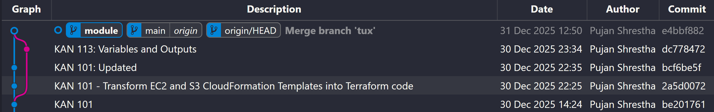
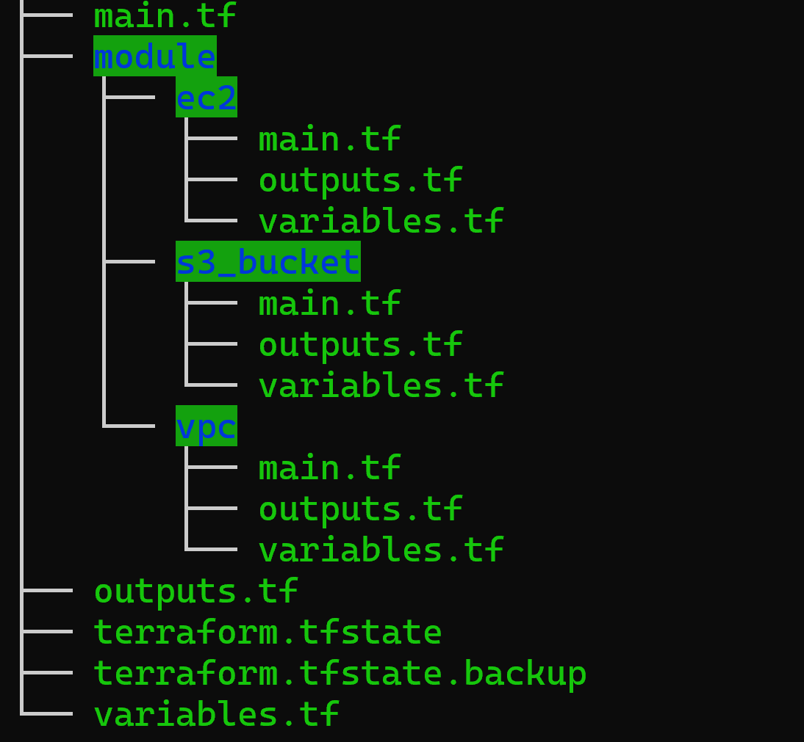

## Introduce Modules on your existing Terraform stack with Variables and Outputs. You might need to create a new branch from the previous branch (not source/main branch).

In this task, the existing Terraform stack was refactored using Terraform Modules to improve reusability, readability, and maintainability.
The infrastructure components (VPC, EC2, and S3) were modularized, each with clearly defined inputs (variables) and outputs.

This approach follows Terraform best practices and prepares the codebase for scalable, production-ready infrastructure management.

For a clean working directory, we have merged the `tux` branch to the `main`
```
# Create module branch from tux branch
git checkout tux
git checkout -b module

# After module implementation, merge tux to main
git checkout main
git merge tux
```
**Branch Structure:**
- `main` - Production-ready code
- `tux` - Previous working branch
- `module` - New branch for modular implementation

The graph has been shown as:



The folder tree structure has been shown as:

---

### Module 1: VPC
The VPC module creates a complete networking infrastructure on AWS, including VPC, subnets, internet gateway, routing, and security groups. This module provides a foundational network layer for hosting EC2 instances and other AWS resources.
```
┌─────────────────────────────────────────────────────────┐
│                      AWS VPC                            │
│                   10.0.0.0/16                           │
│                                                         │
│  ┌─────────────────────────────────────────────────┐    │
│  │         Public Subnet (us-east-1a)              │    │ 
│  │            10.0.1.0/24                          │    │
│  │                                                 │    │
│  │  ┌──────────────────────────────────────┐       │    │
│  │  │     Security Group                   │       │    │
│  │  │  - SSH (22)      ← 0.0.0.0/0         │       │    │
│  │  │  - HTTP (80)     ← 0.0.0.0/0         │       │    │
│  │  │  - All Outbound  → 0.0.0.0/0         │       │    │
│  │  └──────────────────────────────────────┘       │    │
│  │                                                 │    │
│  └─────────────────────┬───────────────────────────┘    │
│                        │                                │
│                        │ Route Table                    │
│                        │ 0.0.0.0/0 → IGW                │
│                        │                                │
└────────────────────────┼────────────────────────────────┘
                         │
                         ▼
              Internet Gateway (IGW)
                         │
                         ▼
                     Internet
```
`main.tf`
#### Resources Created
The VPC module provisions the following AWS resources:

- **VPC** with configurable CIDR block

- **Internet Gateway** attached to the VPC

- **Public Subnet**

- **Route Table** with a default route to the Internet Gateway

- **Route Table Association** for the public subnet

- **Security Group** allowing:

    - SSH (port 22)

    - HTTP (port 80)

    - All outbound traffic

This setup ensures that EC2 instances launched in the subnet are publicly accessible and internet-enabled.

**VPC Resource**
```
resource "aws_vpc" "lab_vpc" {
  cidr_block           = var.vpc_cidr
  enable_dns_support   = var.enable_dns_support
  enable_dns_hostnames = var.enable_dns_hostnames
  
  tags = {
    Name = "${var.project_name}-LabVPC"
  }
}
```

**Internet Gateway**

**Purpose:** Provides internet connectivity for resources in public subnets.
```
resource "aws_internet_gateway" "lab_igw" {
  vpc_id = aws_vpc.lab_vpc.id
  
  tags = {
    Name = "${var.project_name}-LabInternetGateway"
  }
}
```
**Public Subnet**
```
resource "aws_subnet" "lab_subnet" {
  vpc_id                  = aws_vpc.lab_vpc.id
  cidr_block              = var.subnet_cidr
  availability_zone       = "us-east-1a"
  map_public_ip_on_launch = true
  
  tags = {
    Name = "${var.project_name}-LabSubnet"
  }
}
```

**Route Table and Routes**
```
resource "aws_route_table" "lab_route_table" {
  vpc_id = aws_vpc.lab_vpc.id
  
  tags = {
    Name = "${var.project_name}-LabRouteTable"
  }
}

resource "aws_route" "lab_route" {
  route_table_id         = aws_route_table.lab_route_table.id
  destination_cidr_block = "0.0.0.0/0"
  gateway_id             = aws_internet_gateway.lab_igw.id
}

resource "aws_route_table_association" "lab_subnet_association" {
  subnet_id      = aws_subnet.lab_subnet.id
  route_table_id = aws_route_table.lab_route_table.id
}
```

**Security Group**
```
resource "aws_security_group" "lab_sg" {
  name        = "LabSecurityGroup"
  description = "Allow SSH and HTTP traffic"
  vpc_id      = aws_vpc.lab_vpc.id
  
  tags = {
    Name = "${var.project_name}-LabSecurityGroup"
  }
}
```

**Security Group Rules**
- **SSH Access**
```
resource "aws_vpc_security_group_ingress_rule" "allow_ssh" {
  security_group_id = aws_security_group.lab_sg.id
  description       = "SSH from anywhere"
  from_port         = 22
  to_port           = 22
  ip_protocol       = "tcp"
  cidr_ipv4         = "0.0.0.0/0"
}
```

- **HTTP Access**
```
resource "aws_vpc_security_group_ingress_rule" "allow_http" {
  security_group_id = aws_security_group.lab_sg.id
  description       = "HTTP from anywhere"
  from_port         = 80
  to_port           = 80
  ip_protocol       = "tcp"
  cidr_ipv4         = "0.0.0.0/0"
}
```

- **Outbound Traffic**
```
resource "aws_vpc_security_group_egress_rule" "allow_all_outbound" {
  security_group_id = aws_security_group.lab_sg.id
  description       = "Allow all outbound traffic"
  ip_protocol       = "-1"
  cidr_ipv4         = "0.0.0.0/0"
}
```
`Variables.tf`
The VPC module is configured using the following input variables.


```
variable "project_name" {
    description = "Describes the name of the Project"
    type = string
    # default = "terraform-project" 
}

variable "vpc_cidr" {
    description = "CIDR Block for VPC"
    type = string
    default = "10.0.0.0/16"

    validation {
      condition = can(cidrhost(var.vpc_cidr, 0))
      error_message = "VPC CIDR must be a valid IPv4 CIDR block."
    }
}

variable "subnet_cidr" {
    description = "CIDR Block for public subnet"
    type = string
    default = "10.0.1.0/24"

    validation {
      condition = can(cidrhost(var.subnet_cidr, 0))
      error_message = "Subnet CIDR must be a valid IPv4 CIDR block."
    }
}

variable "enable_dns_hostnames" {
    description = "Enable DNS hostnames in VPC"
    type =bool
    default = true
}

variable "enable_dns_support" {
    description = "Enable DNS support in VPC"
    type = bool
    default = true
}
```

`Outputs.tf`
The VPC module exposes critical values that are required by other modules:
```
output "subnet_id" {
  description = "Subnet ID"
  value       = aws_subnet.lab_subnet.id
}

output "security_group_id" {
  description = "Security Group ID"
  value       = aws_security_group.lab_sg.id
}

output "igw" {
  value = aws_internet_gateway.lab_igw.id
}
```
---
### Module 2: EC2 Module
Location: `./modules/ec2/`

**Purpose**
Creates an EC2 instance with Ubuntu 22.04 LTS, SSH key pair, Elastic IP, and pre-configured nginx web server.
**Files**
`main.tf`
**Data Source - Ubuntu AMI:**
```
data "aws_ami" "ubuntu" {
  most_recent = true
  owners      = ["099720109477"] # Canonical
  
  filter {
    name   = "name"
    values = ["ubuntu/images/hvm-ssd/ubuntu-jammy-22.04-amd64-server-*"]
  }
  
  filter {
    name   = "virtualization-type"
    values = ["hvm"]
  }
  
  filter {
    name   = "architecture"
    values = ["x86_64"]
  }
}
```

**Key Pair Resource:**
```
resource "aws_key_pair" "lab_key" {
  key_name   = var.key_name
  public_key = file(var.ssh_public_key_path)
}
```

**EC2 Instance**
```
resource "aws_instance" "lab_ec2" {
  ami                    = data.aws_ami.ubuntu.id
  instance_type          = var.instance_type
  key_name               = aws_key_pair.lab_key.key_name
  subnet_id              = var.subnet_id
  vpc_security_group_ids = [var.security_group_id]
  
  root_block_device {
    volume_type           = var.root_volume_type
    volume_size           = var.root_volume_size
    delete_on_termination = true
    encrypted             = var.enable_root_encryption
  }
  
  disable_api_termination              = false
  instance_initiated_shutdown_behavior = "stop"
  
  user_data = <<-EOF
              #!/bin/bash
              apt-get update
              apt-get install -y nginx
              systemctl start nginx
              systemctl enable nginx
              echo "<h1>Terraform EC2 Instance - $(hostname)</h1>" > /var/www/html/index.html
              EOF
  
  tags = {
    Name = "${var.project_name}-MyEC2"
  }
}
```

**ElasticIP**
```
resource "aws_eip" "lab_eip" {
  domain   = "vpc"
  instance = aws_instance.lab_ec2.id
  
  tags = {
    Name = "${var.project_name}-LabElasticIP"
  }
  
  depends_on = [var.igw_id]
}
```

`Variables.tf`

The EC2 module is parameterized using the following input variables.
```
variable "project_name" {
    description = "Describes the name of the Project"
    type = string
    # default = "terraform-project"
}

variable "igw_id" {
     type = string
}

variable "instance_type" {
     description = "EC2 Instance Type"
     type = string
     default = "t3.micro"
}

variable "root_volume_size" {
     description = "Size of Root EBS volume in GB"
     type = number
     default = 20

     validation {
       condition = var.root_volume_size >= 8 && var.root_volume_size <= 100
       error_message = "Root Volume size must be in between 8 GB and 100 GB"
     }
}

variable "root_volume_type" {
     description = "Type of Root EBS Volume"
     type = string
     default = "gp3"

     validation {
       condition = contains(["gp2", "gp3", "io1", "io2"], var.root_volume_type)
       error_message = "Volume Type must be gp2, gp3, io1 or io2"
     }
}

variable "enable_root_encryption" {
     description = "Enable Root Encryption"
     type = bool
     default = true
}

variable "key_name" {
     description = "Name of SSH KeyPair"
     type = string
     default = "terraform-key"
}

variable "ssh_public_key_path" {
     description = "Path to SSH Public Key File"
     type = string
     default = "~/.ssh/terraform-key.pub"
}

variable "subnet_id" {
    description = "Subnet ID"
    type = string
}

variable "security_group_id" {
    description = "Security Group"
    type = string  
}
```

`outputs.tf`

The module exposes important values for reuse by other modules or the root configuration.
This allows the root module to reference the Elastic IP if needed for DNS, logging, or outputs.
```
output "aws_eip" {
  value       = aws_eip.lab_eip.id
  description = "Elastic IP ID"
}
```

## Module 3: S3 Bucket
Module 3: S3 Bucket Module (./modules/s3)

The S3 module provisions secure, production-ready S3 storage by implementing two separate buckets:

Log Bucket – dedicated to storing S3 access logs

Secure Bucket – primary data bucket with encryption, versioning, HTTPS enforcement, and logging enabled

This separation follows AWS security best practices and ensures auditability, durability, and compliance.

**Architecture Overview**
```
Secure S3 Bucket
 ├── Server-side encryption
 ├── Versioning enabled
 ├── Public access blocked
 ├── HTTPS-only access enforced
 └── Access logs ─────▶ Log Bucket
                           ├── Encryption enabled
                           ├── Versioning enabled
                           ├── Lifecycle rules
                           └── Public access blocked
```
#### Log Bucket Configuration

The **Log Bucket** is used exclusively to store access logs generated by the Secure Bucket.

**Key Features**

- Unique bucket name using:

    - AWS account ID

    - Current date (YYYYMMDD)

- Server-side encryption enabled

- Versioning enabled

- Public access fully blocked

- Lifecycle rules to manage log retention

- ACL configured to allow AWS log delivery

#### Lifecycle Management

 - Current object expiration: 90 days

 - Non-current version expiration: 30 days

This prevents uncontrolled growth of log storage while retaining logs long enough for auditing and troubleshooting.

#### Secure Bucket Configuration

The **Secure Bucket** is the primary storage bucket designed with strong security controls.

**Key Features**

    - Server-side encryption (AES-256)

    - Versioning enabled

    - Public access completely blocked

    - Ownership enforced (BucketOwnerEnforced)

    - Access logging enabled (sent to Log Bucket)

    - HTTPS-only access enforced via bucket policy

`main.tf`
```
# Log Bucket
resource "aws_s3_bucket" "log_bucket" {
  bucket = "terraform-lab-logs-${var.account_id}-${formatdate("YYYYMMDD", timestamp())}"

  tags = {
    Name        = "LogBucket"
    Description = "S3 access logs bucket"
  }

  lifecycle {
    ignore_changes = [bucket]
  }
}

resource "aws_s3_bucket_ownership_controls" "log_bucket_ownership" {
  bucket = aws_s3_bucket.log_bucket.id

  rule {
    object_ownership = "BucketOwnerPreferred"
  }
}

resource "aws_s3_bucket_acl" "log_bucket_acl" {
  bucket = aws_s3_bucket.log_bucket.id
  acl    = "log-delivery-write"

  depends_on = [aws_s3_bucket_ownership_controls.log_bucket_ownership]
}

resource "aws_s3_bucket_server_side_encryption_configuration" "log_bucket_encryption" {
  bucket = aws_s3_bucket.log_bucket.id

  rule {
    apply_server_side_encryption_by_default {
      sse_algorithm = var.s3_encryption_algorithm
    }
    bucket_key_enabled = true
  }
}

resource "aws_s3_bucket_versioning" "log_bucket_versioning" {
  bucket = aws_s3_bucket.log_bucket.id

  versioning_configuration {
    status = var.enable_s3_versioning
  }
}

resource "aws_s3_bucket_public_access_block" "log_bucket_public_access" {
  bucket = aws_s3_bucket.log_bucket.id

  block_public_acls       = true
  ignore_public_acls      = true
  block_public_policy     = true
  restrict_public_buckets = true
}

resource "aws_s3_bucket_lifecycle_configuration" "log_bucket_lifecycle" {
  bucket = aws_s3_bucket.log_bucket.id

  rule {
    id     = "expire-old-logs"
    status = "Enabled"

    expiration {
      days = 90
    }

    noncurrent_version_expiration {
      noncurrent_days = 30
    }
  }
}       

# Secure Bucket
resource "aws_s3_bucket" "secure_bucket" {
  bucket = "terraform-lab-secure-${var.account_id}-${formatdate("YYYYMMDD", timestamp())}"

  tags = {
    Name        = "SecureBucket"
    Description = "Main secure S3 bucket with encryption and versioning"
  }

  lifecycle {
    ignore_changes = [bucket]
  }
}

resource "aws_s3_bucket_versioning" "secure_bucket_versioning" {
  bucket = aws_s3_bucket.secure_bucket.id

  versioning_configuration {
    status = "Enabled"
  }
}

resource "aws_s3_bucket_server_side_encryption_configuration" "secure_bucket_encryption" {
  bucket = aws_s3_bucket.secure_bucket.id

  rule {
    apply_server_side_encryption_by_default {
      sse_algorithm = "AES256"
    }
    bucket_key_enabled = true
  }
}

resource "aws_s3_bucket_public_access_block" "secure_bucket_public_access" {
  bucket = aws_s3_bucket.secure_bucket.id

  block_public_acls       = true
  ignore_public_acls      = true
  block_public_policy     = true
  restrict_public_buckets = true
}

resource "aws_s3_bucket_ownership_controls" "secure_bucket_ownership" {
  bucket = aws_s3_bucket.secure_bucket.id

  rule {
    object_ownership = "BucketOwnerEnforced"
  }
}

resource "aws_s3_bucket_logging" "secure_bucket_logging" {
  bucket = aws_s3_bucket.secure_bucket.id

  target_bucket = aws_s3_bucket.log_bucket.id
  target_prefix = "access-logs/"

  depends_on = [aws_s3_bucket_acl.log_bucket_acl]
}

resource "aws_s3_bucket_policy" "enforce_https" {
  bucket = aws_s3_bucket.secure_bucket.id

  policy = jsonencode({
    Version = "2012-10-17"
    Statement = [
      {
        Sid       = "EnforceTLS"
        Effect    = "Deny"
        Principal = "*"
        Action    = "s3:*"
        Resource = [
          aws_s3_bucket.secure_bucket.arn,
          "${aws_s3_bucket.secure_bucket.arn}/*"
        ]
        Condition = {
          Bool = {
            "aws:SecureTransport" = "false"
          }
        }
      }
    ]
  })
}
```
`variables.tf`
```
variable "account_id" {
    description = "AWS Account ID"
    type = string
}

variable "s3_encryption_algorithm" {
    description = "S3 Encryption Algorithm AES256"
    type = string
    default = "AES256"
}

variable "enable_s3_versioning" {
    description = "Enable Versioning in Log Bucket"
    type = string
    default = "Enabled"
}

variable "log_expiration_days" {
    description = "Days after which logs expire"
    type = number
    default = 90
}

variable "log_noncurrent_expiration_days" {
    description = "Days after which non-current versions expire"
    type = number
    default = 30
}
```
`outputs.tf`
```
output "log_bucket_name" {
  description = "Log bucket name"
  value       = aws_s3_bucket.log_bucket.bucket
}

output "secure_bucket_name" {
  description = "Secure bucket name"
  value       = aws_s3_bucket.secure_bucket.bucket
}

output "secure_bucket_arn" {
  description = "Secure bucket ARN"
  value       = aws_s3_bucket.secure_bucket.arn
}
```