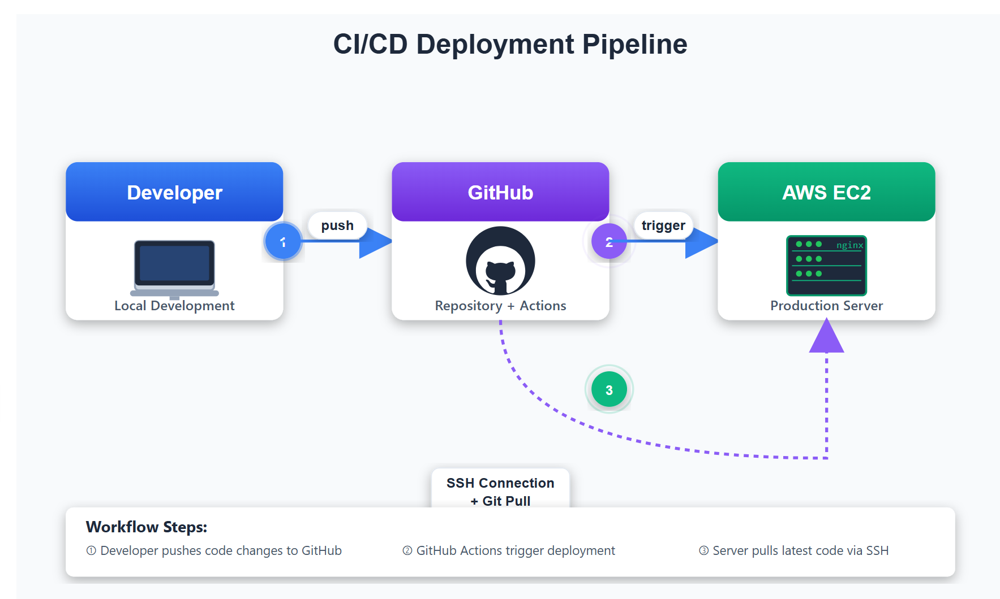

# Complete CI/CD Pipeline Documentation
## Automated Deployment with GitHub Actions, Nginx, and AWS EC2

---

## Table of Contents

1. [Introduction](#introduction)
2. [Architecture Overview](#architecture-overview)
3. [Prerequisites](#prerequisites)
4. [Part 1: AWS EC2 Setup](#part-1-aws-ec2-setup)
5. [Part 2: GitHub Repository Setup](#part-2-github-repository-setup)
6. [Part 3: Nginx Configuration on EC2](#part-3-nginx-configuration-on-ec2)
7. [Part 4: GitHub Actions Workflow](#part-4-github-actions-workflow)
8. [Part 5: Configure Secrets and Variables](#part-5-configure-secrets-and-variables)
9. [Part 6: Testing the Pipeline](#part-6-testing-the-pipeline)
10. [Troubleshooting Guide](#troubleshooting-guide)
11. [Security Best Practices](#security-best-practices)
12. [Advanced Configurations](#advanced-configurations)

---

## Introduction

This documentation provides a comprehensive guide to setting up a fully automated CI/CD (Continuous Integration/Continuous Deployment) pipeline. The pipeline automatically deploys static web content from a GitHub repository to an AWS EC2 instance running Nginx whenever changes are pushed to the main branch.

### What You'll Build

A production-ready deployment pipeline that:
- Automatically detects changes pushed to GitHub
- Securely connects to your EC2 instance
- Updates your live website without manual intervention
- Provides deployment logs and status updates

### Use Cases

- Static website hosting (portfolios, documentation, blogs)
- Rapid prototyping and testing
- Small business websites
- Learning DevOps practices

---

## Architecture Overview



### Workflow Steps

1. Developer makes changes locally and pushes to GitHub
2. GitHub Actions workflow is triggered automatically
3. Workflow connects to EC2 via SSH
4. Git pulls latest changes from the repository
5. Nginx serves the updated content immediately

---

## Prerequisites

### Required Accounts and Tools

-  **AWS Account** with permissions to:
  - Launch EC2 instances
  - Modify security groups
  - Access EC2 instances via SSH

-  **GitHub Account** (free tier is sufficient)

-  **Local Development Environment**:
  - Git installed ([Download Git](https://git-scm.com/downloads))
  - Text editor (VS Code, Sublime, etc.)
  - Terminal/Command Prompt access

### Required Knowledge

- Basic Linux command line navigation
- Understanding of Git version control
- Basic networking concepts (IP addresses, ports)

### Hardware Requirements

- EC2: t2.micro instance (free tier eligible)
- Local: Any modern computer with internet connection

---

## Part 1: AWS EC2 Setup

### Step 1.1: Launch EC2 Instance

**Navigate to EC2 Dashboard:**

1. Log into [AWS Console](https://console.aws.amazon.com)
2. Search for "EC2" in the services search bar
3. Click on "EC2" to open the dashboard
4. Click the orange "Launch Instance" button

**Configure Your Instance:**

| Setting | Value | Notes |
|---------|-------|-------|
| Name | `nginx-web-server` | Choose a descriptive name |
| AMI | Amazon Linux 2023 | Or Amazon Linux 2 |
| Instance Type | t2.micro | Free tier eligible |
| Key Pair | Create new or select existing | **Save the .pem file securely!** |
| Network Settings | Default VPC | We'll modify security group next |

**Important:** When creating a key pair, download the `.pem` file and store it securely. You'll need this for SSH access.

### Step 1.2: Configure Security Group

During instance launch or after creation, configure the security group:

**Inbound Rules to Add:**

```
Rule 1: SSH Access
├── Type: SSH
├── Protocol: TCP
├── Port: 22
├── Source: My IP (recommended) or 0.0.0.0/0 (less secure)
└── Description: SSH access for management

Rule 2: HTTP Access
├── Type: HTTP
├── Protocol: TCP
├── Port: 80
├── Source: 0.0.0.0/0 (allows public web access)
└── Description: Allow web traffic
```

**To Modify Security Group After Launch:**

1. Select your instance in EC2 dashboard
2. Click on the "Security" tab
3. Click on the security group link
4. Click "Edit inbound rules"
5. Click "Add rule" to add HTTP rule
6. Click "Save rules"

### Step 1.3: Connect to EC2 Instance

**Find Your Instance Details:**

1. In EC2 dashboard, select your instance
2. Note the "Public IPv4 address" (e.g., 54.123.45.67)
3. Ensure instance state shows "Running"

**Connect via SSH:**

```bash
# Navigate to directory containing your .pem file
cd ~/path/to/key

# Set correct permissions (required on first use)
chmod 400 your-key-name.pem

# Connect to instance
ssh -i your-key-name.pem ec2-user@<PUBLIC_IP_ADDRESS>

# Example:
ssh -i terraform-key.pem ec2-user@54.123.45.67
```

**First-Time Connection:**

You'll see a message like:
```
The authenticity of host '54.123.45.67' can't be established.
Are you sure you want to continue connecting (yes/no)?
```
Type `yes` and press Enter.

### Step 1.4: Install Nginx

Once connected to your EC2 instance:

```bash
# Update system packages
sudo yum update -y

# Install Nginx
sudo yum install nginx -y

# Start Nginx service
sudo systemctl start nginx

# Enable Nginx to start automatically on boot
sudo systemctl enable nginx

# Verify Nginx is running
sudo systemctl status nginx
```

**Expected Output:**
```
● nginx.service - The nginx HTTP and reverse proxy server
   Loaded: loaded (/usr/lib/systemd/system/nginx.service; enabled)
   Active: active (running) since...
```

Press `q` to exit the status view.

**Verify Installation:**

Open a web browser and navigate to: `http://<YOUR_EC2_PUBLIC_IP>`

You should see the default Nginx welcome page.

---

## Part 2: GitHub Repository Setup

### Step 2.1: Create GitHub Repository

**On GitHub.com:**

1. Log into your GitHub account
2. Click the `+` icon in the top-right corner
3. Select "New repository"
4. Configure repository:
   - **Repository name:** `ci-cd` (or your preferred name)
   - **Description:** "Automated deployment with GitHub Actions"
   - **Visibility:** Public or Private
   - **DO NOT** initialize with README, .gitignore, or license
5. Click "Create repository"

**Save the Repository URL:**

You'll see a URL like: `https://github.com/YOUR_USERNAME/ci-cd.git`

### Step 2.2: Initialize Local Repository

**On Your Local Machine:**

```bash
# Create project directory
mkdir ci-cd
cd ci-cd

# Initialize Git repository
git init

# Verify initialization
git status
```

**Expected Output:**
```
Initialized empty Git repository in /path/to/ci-cd/.git/
On branch main
No commits yet
```

### Step 2.3: Create Initial Web Content

**Create index.html:**

```bash
# Create index.html file
cat > index.html << 'EOF'
<!DOCTYPE html>
<html lang="en">
<head>
    <meta charset="UTF-8">
    <meta name="viewport" content="width=device-width, initial-scale=1.0">
    <title>CI/CD Pipeline Demo</title>
    <style>
        body {
            font-family: Arial, sans-serif;
            max-width: 800px;
            margin: 50px auto;
            padding: 20px;
            background: linear-gradient(135deg, #667eea 0%, #764ba2 100%);
            color: white;
        }
        .container {
            background: rgba(255, 255, 255, 0.1);
            padding: 30px;
            border-radius: 10px;
            backdrop-filter: blur(10px);
        }
        h1 {
            margin-top: 0;
        }
        .badge {
            display: inline-block;
            background: rgba(255, 255, 255, 0.2);
            padding: 5px 15px;
            border-radius: 20px;
            margin: 10px 5px;
        }
    </style>
</head>
<body>
    <div class="container">
        <h1> CI/CD Pipeline Active!</h1>
        <p>This website is automatically deployed using GitHub Actions.</p>
        
        <h2>Pipeline Components:</h2>
        <div class="badge">GitHub Actions</div>
        <div class="badge">AWS EC2</div>
        <div class="badge">Nginx</div>
        <div class="badge">Git</div>
        
        <h2>How It Works:</h2>
        <p> Code is pushed to GitHub<br>
            GitHub Actions workflow is triggered<br>
            SSH connection established to EC2<br>
            Latest changes pulled automatically<br>
            Website updated instantly!</p>
        
        <p><strong>Version:</strong> 1.0.0</p>
    </div>
</body>
</html>
EOF

# Verify file creation
cat index.html
```

### Step 2.4: Push to GitHub

```bash
# Add GitHub remote repository
git remote add origin https://github.com/YOUR_USERNAME/ci-cd.git

# Verify remote was added
git remote -v

# Stage all files
git add .

# Commit with message
git commit -m "Initial commit: Add index.html"

# Create main branch and push
git branch -M main
git push -u origin main
```

**Authentication:**

If prompted for credentials:
- **Username:** Your GitHub username
- **Password:** Use a [Personal Access Token](https://github.com/settings/tokens) (not your account password)

**Verify on GitHub:**

1. Refresh your repository page on GitHub
2. You should see `index.html` in the file list

---

## Part 3: Nginx Configuration on EC2

### Step 3.1: Navigate to Nginx Directory

**SSH into your EC2 instance** (if not already connected):

```bash
ssh -i your-key.pem ec2-user@<EC2_PUBLIC_IP>
```

**Navigate to Nginx web root:**

```bash
# Go to Nginx directory
cd /usr/share/nginx

# List contents
ls -la
```

**Expected Output:**
```
drwxr-xr-x  4 root root   33 Dec 31 10:00 .
drwxr-xr-x 48 root root 4096 Dec 31 09:45 ..
drwxr-xr-x  2 root root   40 Dec 31 10:00 html
drwxr-xr-x  2 root root    6 Oct 15 12:34 modules
```

**Directory Explanation:**

- `html/` - Contains web files served by Nginx (this is where we'll deploy)
- `modules/` - Contains Nginx dynamic modules (we won't modify this)

### Step 3.2: Change Directory Permissions

**Why Change Permissions?**

By default, the `html` directory is owned by `root`. We need `ec2-user` to have write permissions to allow Git operations.

```bash
# Change ownership recursively
sudo chown -R ec2-user:ec2-user html

# Verify ownership change
ls -la
```

**Expected Output After Change:**
```
drwxr-xr-x  2 ec2-user ec2-user   40 Dec 31 10:00 html
```

**Permission Breakdown:**

- `-R` : Recursive (applies to all files and subdirectories)
- `ec2-user:ec2-user` : Sets owner to ec2-user and group to ec2-user

### Step 3.3: Backup Existing Content

**Create a backup** (recommended before making changes):

```bash
# Create backup of html directory
sudo cp -R html html-bkp

# Verify backup was created
ls -la

# You should see both html and html-bkp directories
```

**Why Backup?**

If something goes wrong, you can restore the original Nginx welcome page:
```bash
# To restore backup (if needed)
sudo rm -rf html
sudo cp -R html-bkp html
```

### Step 3.4: Clear Default Content

```bash
# Navigate into html directory
cd html

# Show current contents
ls -la

# Remove all default files
rm -rf *

# Verify directory is empty
ls -la
```

**Warning:** This permanently deletes all files in the directory. Make sure you're in the correct location (`/usr/share/nginx/html`).

### Step 3.5: Install Git

```bash
# Install Git
sudo yum install git -y

# Verify installation
git --version
```

**Expected Output:**
```
git version 2.40.1
```

### Step 3.6: Clone GitHub Repository

You have **two methods** to clone your repository:

#### Method 1: Clone into Subdirectory (Then Move Files)

```bash
# Clone repository (creates ci-cd folder)
git clone https://github.com/YOUR_USERNAME/ci-cd.git

# Verify clone
ls -la

# You should see a ci-cd directory
# Navigate into it
cd ci-cd

# List contents
ls -la

# Move index.html to parent directory
mv index.html ../

# Go back to html directory
cd ..

# Remove empty ci-cd directory
rm -rf ci-cd

# Verify final structure
ls -la
# You should see: index.html and .git directory
```

#### Method 2: Clone Directly into Current Directory (Recommended)

```bash
# Clone repository contents into current directory
git clone https://github.com/YOUR_USERNAME/ci-cd.git .

# The dot (.) means "current directory"
# This places all repository contents here without creating a subdirectory

# Verify
ls -la

# You should see:
# - index.html
# - .git/ (hidden directory)
```

**Explanation of the Dot (`.`)**

The `.` tells Git to clone the repository contents directly into the current directory instead of creating a new subdirectory with the repository name.

### Step 3.7: Verify Deployment

**Test in Browser:**

1. Open a web browser
2. Navigate to: `http://<YOUR_EC2_PUBLIC_IP>`
3. You should see your custom `index.html` page (not the Nginx default page)

**If You See the Nginx Default Page:**

```bash
# Clear browser cache and hard refresh
# Chrome/Firefox: Ctrl + Shift + R (Windows/Linux)
# Chrome/Firefox: Cmd + Shift + R (Mac)

# Or check Nginx configuration
sudo nginx -t
sudo systemctl restart nginx
```

---

## Part 4: GitHub Actions Workflow

GitHub Actions automate the deployment process. We'll create a workflow that triggers whenever code is pushed to the main branch.

### Step 4.1: Create Workflow Directory Structure

**On Your Local Machine** (in your project directory):

```bash
# Navigate to project directory
cd ~/ci-cd  # or wherever your local repository is

# Create .github/workflows directory structure
mkdir -p .github/workflows

# Verify directory creation
tree .github  # or: ls -la .github/workflows/
```

**Directory Structure:**
```
ci-cd/
├── .github/
│   └── workflows/
│       └── deploy.yaml  (we'll create this next)
├── .git/
└── index.html
```

### Step 4.2: Create Workflow File

**Create the workflow file:**

```bash
# Create deploy.yaml file
touch .github/workflows/deploy.yaml

# Open in your text editor
# VS Code: code .github/workflows/deploy.yaml
# Nano: nano .github/workflows/deploy.yaml
# Vim: vim .github/workflows/deploy.yaml
```

**Add the following content to `deploy.yaml`:**

```yaml
# Workflow name (appears in GitHub Actions tab)
name: Deploy to EC2 Server

# Trigger configuration
on: 
  push:
    branches:
      - main  # Triggers only on pushes to main branch

# Define jobs
jobs:
  deploy:
    name: "Deploy website to Nginx server"
    runs-on: ubuntu-latest  # GitHub-hosted runner
    
    # Environment variables accessible to all steps
    env:
      SERVER_IP: ${{ vars.SERVER_IP }}
    
    steps:
      # ============================================
      # STEP 1: Checkout Repository Code
      # ============================================
      - name: "Checkout repository"
        uses: actions/checkout@v4
        # This action clones your repository into the runner
        # Optional: Uncomment below to fetch full git history
        # with: 
        #   fetch-depth: 0
      
      # ============================================
      # STEP 2: Configure SSH Settings
      # ============================================
      - name: "Configure SSH"
        run: |
          # Create .ssh directory with secure permissions
          mkdir -p ~/.ssh
          chmod 700 ~/.ssh
          
          # Disable strict host key checking
          # This prevents interactive prompts during SSH
          echo -e "Host *\n\tStrictHostKeyChecking no\n\n" > ~/.ssh/config
          
          # Display config for verification (in logs)
          cat ~/.ssh/config
          
          # Create known_hosts file
          touch ~/.ssh/known_hosts
          chmod 600 ~/.ssh/known_hosts
      
      # ============================================
      # STEP 3: Setup SSH Key Authentication
      # ============================================
      - name: "Setup SSH key"
        run: |
          # Create temporary key file
          touch mykey.pem
          
          # Decode base64 SSH key from secrets and save
          echo "$SSH_KEY64" | base64 -d > mykey.pem
          
          # Set restrictive permissions (SSH requirement)
          chmod 400 mykey.pem
          
          # Remove old host key if exists (prevents conflicts)
          ssh-keygen -R $SERVER_IP || true
        env:
          SSH_KEY64: ${{ secrets.SSH_KEY64 }}
      
      # ============================================
      # STEP 4: Deploy to EC2 Server
      # ============================================
      - name: "Deploy code to server"
        run: |
          # SSH into server and execute commands
          # -t: Allocates pseudo-terminal (prevents "not a terminal" errors)
          ssh -t ec2-user@$SERVER_IP -i mykey.pem \
            'cd /usr/share/nginx/html && git pull origin main'
```

### Step 4.3: Workflow Detailed Explanation

#### Workflow Trigger

```yaml
on: 
  push:
    branches:
      - main
```

**What it does:** Automatically runs the workflow whenever code is pushed to the `main` branch.

**Other trigger options:**
- Pull requests: `pull_request:`
- Manual trigger: `workflow_dispatch:`
- Scheduled: `schedule:`

#### Job Configuration

```yaml
jobs:
  deploy:
    runs-on: ubuntu-latest
```

**What it does:** 
- Defines a job named "deploy"
- Runs on GitHub-hosted Ubuntu virtual machine
- GitHub provides the VM, maintains it, and tears it down after completion

#### Environment Variables

```yaml
env:
  SERVER_IP: ${{ vars.SERVER_IP }}
```

**What it does:** Makes the `SERVER_IP` variable accessible to all steps in the job.

**Syntax:**
- `${{ }}` - Expression syntax in GitHub Actions
- `vars.SERVER_IP` - References a variable set in repository settings
- `secrets.SECRET_NAME` - References encrypted secrets

#### Step 1: Checkout Repository

```yaml
- uses: actions/checkout@v4
```

**What it does:**
- Uses a pre-built action from GitHub marketplace
- Clones your repository into the runner
- Default behavior: Checks out the commit that triggered the workflow

**Why needed:** The runner starts with a clean slate. This step gets your code onto the runner.

#### Step 2: Configure SSH

```yaml
- name: "Configure SSH"
  run: |
    mkdir -p ~/.ssh
    chmod 700 ~/.ssh
    echo -e "Host *\n\tStrictHostKeyChecking no\n\n" > ~/.ssh/config
    cat ~/.ssh/config
    touch ~/.ssh/known_hosts
    chmod 600 ~/.ssh/known_hosts
```

**What it does:**

1. **`mkdir -p ~/.ssh`**: Creates SSH directory (if not exists)
2. **`chmod 700 ~/.ssh`**: Sets secure permissions (owner only)
3. **`echo -e "Host *\n\tStrictHostKeyChecking no\n\n" > ~/.ssh/config`**:
   - Creates SSH config file
   - Disables host key verification prompt
   - Prevents workflow from hanging on "Are you sure?" prompt
4. **`cat ~/.ssh/config`**: Displays config (for debugging in logs)
5. **`touch ~/.ssh/known_hosts`**: Creates known hosts file
6. **`chmod 600 ~/.ssh/known_hosts`**: Sets secure permissions

**Permission Values:**
- `700` = `rwx------` (owner: read, write, execute; others: none)
- `600` = `rw-------` (owner: read, write; others: none)

#### Step 3: Setup SSH Key

```yaml
- name: "Setup SSH key"
  run: |
    touch mykey.pem
    echo "$SSH_KEY64" | base64 -d > mykey.pem
    chmod 400 mykey.pem
    ssh-keygen -R $SERVER_IP || true
  env:
    SSH_KEY64: ${{ secrets.SSH_KEY64 }}
```

**What it does:**

1. **`touch mykey.pem`**: Creates empty file for SSH key
2. **`echo "$SSH_KEY64" | base64 -d > mykey.pem`**:
   - Retrieves base64-encoded key from secrets
   - Decodes it back to original format
   - Saves to `mykey.pem`
3. **`chmod 400 mykey.pem`**: Sets read-only permissions for owner
4. **`ssh-keygen -R $SERVER_IP || true`**:
   - Removes any existing host key for this IP
   - `|| true` ensures step doesn't fail if key doesn't exist

**Why base64 encoding?**
- GitHub Secrets store text data
- Binary SSH keys need to be encoded as text
- base64 is a standard encoding method

#### Step 4: Deploy to Server

```yaml
- name: "Deploy code to server"
  run: |
    ssh -t ec2-user@$SERVER_IP -i mykey.pem \
      'cd /usr/share/nginx/html && git pull origin main'
```

**What it does:**

1. **`ssh -t`**: Allocates pseudo-terminal (fixes TTY warnings)
2. **`ec2-user@$SERVER_IP`**: Connects as ec2-user to your EC2 instance
3. **`-i mykey.pem`**: Uses private key for authentication
4. **`'cd /usr/share/nginx/html && git pull origin main'`**:
   - Changes to web root directory
   - Pulls latest changes from main branch
   - `&&` ensures second command runs only if first succeeds

### Step 4.4: Save and Commit Workflow

```bash
# Stage workflow file
git add .github/workflows/deploy.yaml

# Commit (but don't push yet - we need to set up secrets first)
git commit -m "Add GitHub Actions deployment workflow"
```

**Don't push yet!** We need to configure secrets first, or the workflow will fail.

---

## Part 5: Configure Secrets and Variables

GitHub Actions needs two pieces of information to connect to your EC2 instance:
1. **Variable (SERVER_IP)**: Your EC2 public IP address
2. **Secret (SSH_KEY64)**: Your SSH private key (base64 encoded)

### Step 5.1: Encode SSH Private Key

**On Your Local Machine:**

#### For Linux/Mac:

```bash
# Navigate to directory with your .pem file
cd ~/path/to/key

# Encode the key to base64
base64 your-key-name.pem

# For cleaner output (without line breaks):
base64 your-key-name.pem | tr -d '\n'

# Example:
base64 terraform-key.pem | tr -d '\n'
```

#### For Windows (PowerShell):

```powershell
# Navigate to directory with your .pem file
cd C:\path\to\key

# Encode the key to base64
[Convert]::ToBase64String([IO.File]::ReadAllBytes("your-key-name.pem"))

# Example:
[Convert]::ToBase64String([IO.File]::ReadAllBytes("terraform-key.pem"))
```

**Expected Output:**

You'll get a long string like:
```
LS0tLS1CRUdJTiBSU0EgUFJJVkFURSBLRVktLS0tLQpNSUlFcEFJQkFBS0NBUUVBdXpZ...
```

**Important:** 
- Copy the **entire** string (it will be very long, 1000+ characters)
- Include everything from start to finish
- Don't add any extra spaces or line breaks

### Step 5.2: Add Variable (SERVER_IP)

**Navigate to Repository Settings:**

1. Go to your GitHub repository page
2. Click on **"Settings"** tab (top menu)
3. In left sidebar, scroll to "Security" section
4. Click **"Secrets and variables"** → **"Actions"**

**Add SERVER_IP Variable:**

1. Click on the **"Variables"** tab
2. Click **"New repository variable"** (green button)
3. Fill in:
   - **Name**: `SERVER_IP`
   - **Value**: Your EC2 public IP (e.g., `54.123.45.67`)
4. Click **"Add variable"**

**Verification:**

You should see your variable listed:
```
Name          Value          Updated
SERVER_IP     54.123.45.67   Just now
```

### Step 5.3: Add Secret (SSH_KEY64)

**Still in the same page:**

1. Click on the **"Secrets"** tab
2. Click **"New repository secret"** (green button)
3. Fill in:
   - **Name**: `SSH_KEY64`
   - **Value**: Paste the entire base64 string from Step 5.1
4. Click **"Add secret"**

**Verification:**

You should see your secret listed (value is hidden):
```
Name          Updated
SSH_KEY64     Just now
```

**Security Notes:**

- **Secrets** are encrypted and never displayed in logs
- **Variables** are visible in logs (that's why we use it for IP, not the key)
- Only repository admins can view/edit secrets
- GitHub masks secrets in workflow logs automatically

### Step 5.4: Understanding Variables vs Secrets

| Feature | Variables | Secrets |
|---------|-----------|---------|
| **Visibility** | Visible in logs | Hidden in logs |
| **Encryption** | Not encrypted | Encrypted at rest |
| **Use Case** | Non-sensitive data | Sensitive credentials |
| **Examples** | IP addresses, URLs | API keys, passwords, SSH keys |
| **Access in Workflow** | `${{ vars.NAME }}` | `${{ secrets.NAME }}` |

---

## Part 6: Testing the Pipeline

Now that everything is configured, let's test the automated deployment!

### Step 6.1: Push Workflow to GitHub

**On Your Local Machine:**

```bash
# Make sure you're in your project directory
cd ~/ci-cd

# Check status
git status

# If workflow file is already committed (from Step 4.4)
git push origin main

# If not committed yet:
git add .github/workflows/deploy.yaml
git commit -m "Add GitHub Actions deployment workflow"
git push origin main
```

### Step 6.2: Monitor Workflow Execution

**Navigate to Actions Tab:**

1. Go to your GitHub repository
2. Click on **"Actions"** tab (top menu)
3. You should see a workflow run starting

**Workflow View:**

```
All workflows > Deploy to EC2 Server

● Running    "Add GitHub Actions deployment workflow"
  by your-username - commit abc123 - main
  
  1m 23s    Started just now
```

**Click on the workflow run** to see detailed logs.

### Step 6.3: Understanding Workflow Logs

**Job View:**

You'll see each step execute:

```
✓ Set up job                           2s
✓ Checkout repository                  1s
✓ Configure SSH                        0s
✓ Setup SSH key                        1s
✓ Deploy code to server               3s
✓ Complete job                         0s
```

**Click on any step** to see detailed output.

**Example: Deploy code to server output:**

```bash
Warning: Permanently added '54.123.45.67' (ED25519) to the list of known hosts.
Already up to date.
Connection to 54.123.45.67 closed.
```

**Status Indicators:**

- ✓ **Green checkmark**: Step succeeded
- ✗ **Red X**: Step failed
- ● **Yellow dot**: Step in progress
- ⊗ **Gray**: Step skipped

### Step 6.4: Make a Test Change

**Edit index.html locally:**

```bash
# Open index.html in your editor
# Or use this command to add a timestamp

# Update version number and add timestamp
cat > index.html << 'EOF'
<!DOCTYPE html>
<html lang="en">
<head>
    <meta charset="UTF-8">
    <meta name="viewport" content="width=device-width, initial-scale=1.0">
    <title>CI/CD Pipeline Demo - Updated</title>
    <style>
        body {
            font-family: Arial, sans-serif;
            max-width: 800px;
            margin: 50px auto;
            padding: 20px;
            background: linear-gradient(135deg, #667eea 0%, #764ba2 100%);
            color: white;
        }
        .container {
            background: rgba(255, 255, 255, 0.1);
            padding: 30px;
            border-radius: 10px;
            backdrop-filter: blur(10px);
        }
        h1 {
            margin-top: 0;
        }
        .badge {
            display: inline-block;
            background: rgba(255, 255, 255, 0.2);
            padding: 5px 15px;
            border-radius: 20px;
            margin: 10px 5px;
        }
        .timestamp {
            background: rgba(255, 255, 255, 0.3);
            padding: 10px;
            border-radius: 5px;
            margin-top: 20px;
        }
    </style>
</head>
<body>
    <div class="container">
        <h1> CI/CD Pipeline Active!</h1>
        <p>This website is automatically deployed using GitHub Actions.</p>
        
        <h2>Pipeline Components:</h2>
        <div class="badge">GitHub Actions</div>
        <div class="badge">AWS EC2</div>
        <div class="badge